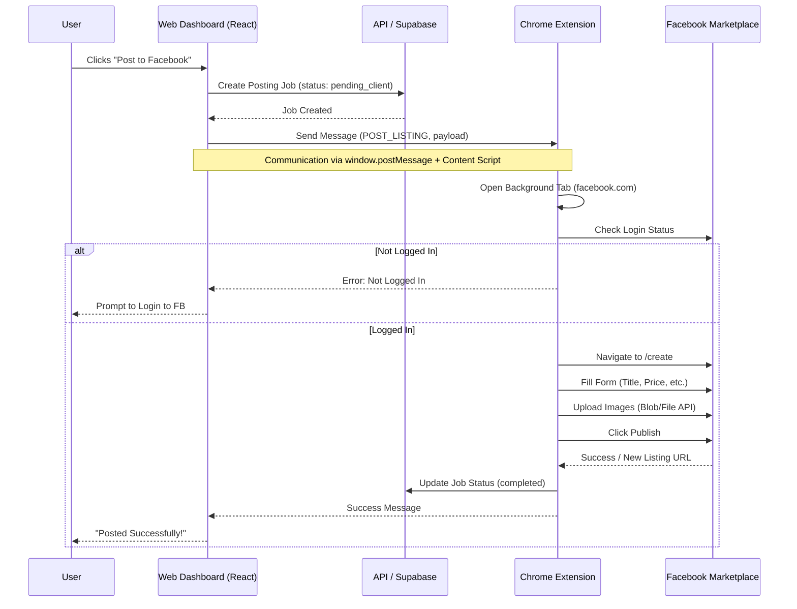

# Client-Side Extension Architecture for Cross-Posting

This document outlines the architecture for the "Client-Side Extension" approach to cross-posting, which moves the automation logic from the backend to the user's browser via a Chrome Extension.

## 1. High-Level Architecture

The system shifts from a "Server-Push" model (Backend -> Puppeteer -> Facebook) to a "Client-Pull" model (User Browser -> Extension -> Facebook).

### Workflow Diagram



## 2. Key Components

### 2.1 Web Dashboard (Frontend)
*   **Role:** Initiates the request and monitors progress.
*   **Mechanism:** Uses `window.postMessage` to communicate with the extension's content script injected into the dashboard page.
*   **Changes:**
    *   New hook `useExtension` to check installation status and send commands.
    *   "Post" button handler to delegate to extension instead of calling backend API directly for posting.

### 2.2 Chrome Extension (Manifest V3)
*   **Role:** The "Driver" that executes the posting logic.
*   **Permissions:** `scripting`, `activeTab`, `storage`, `tabs`, host permissions for `facebook.com` and `craigslist.org`.
*   **Components:**
    *   **Background Service Worker:** Orchestrates the flow. Receives message from Dashboard, opens a new tab, injects the "Posting Script".
    *   **Content Script (Dashboard):** Listens for `window.postMessage` from the React app and relays it to the Service Worker.
    *   **Content Script (Facebook/Craigslist):** The actual automation logic. It runs *inside* the target page context to manipulate DOM elements.

### 2.3 Automation Scripts (The "Drivers")
*   **Logic:** Similar to the Puppeteer adapters but rewritten for standard DOM APIs or a lightweight automation library (like a custom `DOMWalker` helper).
*   **Facebook Driver:**
    *   Navigates to creation wizard.
    *   Uses `DataTransfer` API to simulate drag-and-drop image uploads (crucial because we can't easily control file pickers).
    *   Uses `TrustedEvents` or careful event dispatching (click, input, change, blur) to trigger React listeners.

## 3. Communication Protocol

### Message Format
```json
{
  "type": "EXTENSION_COMMAND",
  "command": "POST_LISTING",
  "payload": {
    "jobId": "123",
    "platform": "facebook",
    "data": {
      "title": "...",
      "price": 100,
      "images": ["url1", "url2"]
    }
  }
}
```

## 4. Security & Isolation
*   **Sandboxing:** The extension runs in the user's browser, using their existing cookies. We do *not* extract or exfiltrate cookies.
*   **CORS:** The extension has host permissions, so it can fetch image blobs from our backend (Supabase Storage) and upload them to Facebook without CORS issues.

## 5. Handling Images
1.  **Dashboard** sends image URLs to Extension.
2.  **Extension Background** fetches the images as `Blob`s.
3.  **Extension** passes Blobs to the **Content Script**.
4.  **Content Script** creates a `File` object from the Blob.
5.  **Content Script** simulates a "drop" event on the upload area or directly attaches to the file input.

## 6. Detailed Implementation Steps

1.  **Refactor Extension:** Convert the existing PoC to a structured architecture (Service Worker + Domain-specific Drivers).
2.  **Create Drivers:**
    *   `drivers/facebook.driver.js`: DOM manipulation logic for FB.
    *   `drivers/craigslist.driver.js`: DOM manipulation logic for CL.
3.  **Frontend Integration:** Update `ListingDetails` page to detect extension and show "Post with Extension" button.
4.  **Backend Update:** Update `posting_jobs` to accept status updates from the extension (via an authenticated API endpoint or simply trust the client if using RLS).
