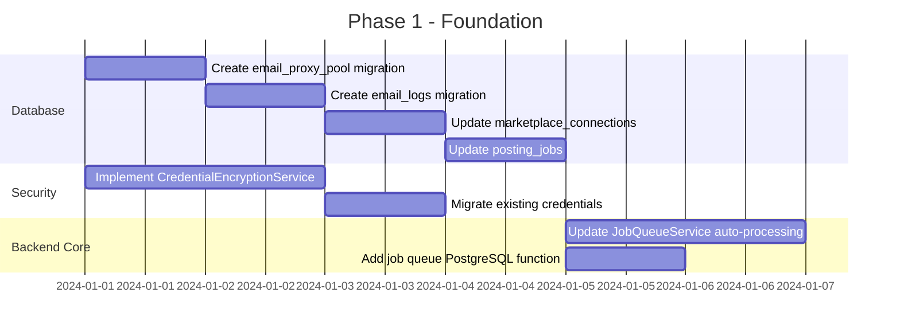
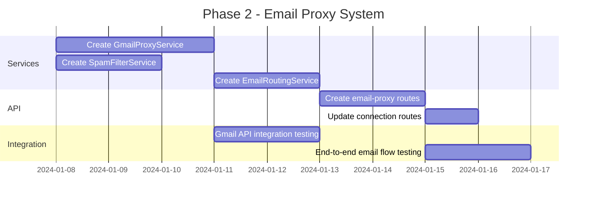
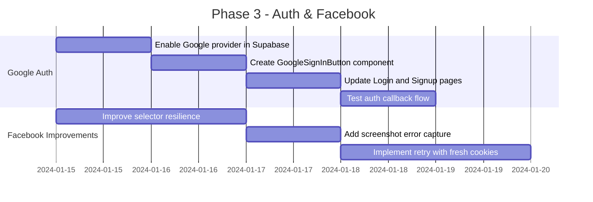
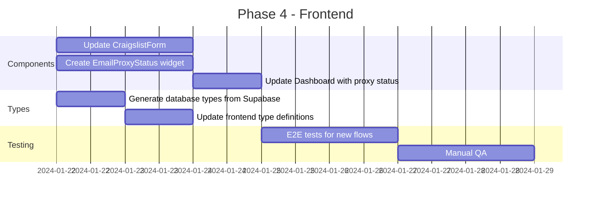

# Cross-Listing Engine Enhancement Implementation Plan

*Created: November 25, 2025*
*Reference: [Cross-Posting Architecture](./cross-posting-architecture.md)*

---

## Executive Summary

This document outlines the comprehensive implementation plan for enhancing the Local Marketplace Lister's cross-listing engine. The project is approximately 70% complete with existing infrastructure for marketplace connections, job queues, and basic adapters. This plan addresses the remaining gaps and introduces new features including:

1. **Craigslist Email Proxy System** - Managed proxy email pool for anonymous listings
2. **Google OAuth Integration** - Additional authentication provider
3. **Facebook Integration Improvements** - More robust automation with better error recovery
4. **Database Schema Additions** - New tables for email proxy management and enhanced security
5. **Backend Service Architecture** - New services for email routing, spam filtering, and auto-processing
6. **Frontend Updates** - Enhanced UI for connections and authentication

### Current State Summary

| Component | Status | Notes |
|-----------|--------|-------|
| Schema (posting_jobs, marketplace_connections) | ✅ Done | Migrations exist |
| Connections UI/API | ✅ Done | Basic CRUD working |
| Auth (Supabase + JWT) | ✅ Done | Email/password only |
| Email Service (basic IMAP) | ⚠️ Partial | Polling works, no proxy pool |
| Marketplace Adapters | ⚠️ MVP | Craigslist/FB/OfferUp exist but fragile |
| Job Queue Logic | ⚠️ Partial | No auto-processing loop |
| Credential Encryption | ❌ Missing | Stored as plaintext JSONB |
| Frontend DB Types | ⚠️ Partial | Manual types, not synced |

---

## 1. System Architecture Diagrams

### 1.1 High-Level Architecture

```
┌─────────────────────────────────────────────────────────────────────────────┐
│                              FRONTEND (React + Vite)                       │
├─────────────────────────────────────────────────────────────────────────────┤
│  ┌──────────────┐  ┌──────────────┐  ┌──────────────┐  ┌──────────────┐    │
│  │   Dashboard  │  │  Connections │  │   Listings   │  │  Auth Pages  │    │
│  │   - Stats    │  │  - Forms     │  │  - CRUD      │  │  - Login     │    │
│  │   - Messages │  │  - Status    │  │  - CrossPost │  │  - Signup    │    │
│  │   - Proxy    │  │  - Email/Phone│ │  - Jobs      │  │  - Google    │    │
│  └──────────────┘  └──────────────┘  └──────────────┘  └──────────────┘    │
└─────────────────────────────────────────────────────────────────────────────┘
                                      │
                                      ▼
┌─────────────────────────────────────────────────────────────────────────────┐
│                           BACKEND (Express + Node.js)                      │
├─────────────────────────────────────────────────────────────────────────────┤
│  ┌──────────────────────────────────────────────────────────────────────┐  │
│  │                          API Routes Layer                            │  │
│  │  /auth  /connections  /listings  /jobs  /webhooks  /email-proxy     │  │
│  └──────────────────────────────────────────────────────────────────────┘  │
│                                      │                                      │
│  ┌──────────────────────────────────────────────────────────────────────┐  │
│  │                         Services Layer                               │  │
│  │ ┌────────────┐ ┌──────────────┐ ┌─────────────┐ ┌─────────────────┐ │  │
│  │ │ AuthService│ │ConnectionSvc │ │EmailProxySvc│ │  JobQueueSvc    │ │  │
│  │ │- Google    │ │- CRUD        │ │- Pool Mgmt  │ │- Auto-process   │ │  │
│  │ │- Supabase  │ │- Encryption  │ │- Gmail API  │ │- Retry logic    │ │  │
│  │ └────────────┘ └──────────────┘ └─────────────┘ └─────────────────┘ │  │
│  │ ┌────────────┐ ┌──────────────┐ ┌─────────────┐                     │  │
│  │ │SpamFilter  │ │EmailRouting  │ │  Adapters   │                     │  │
│  │ │- Keywords  │ │- Match job   │ │- Craigslist │                     │  │
│  │ │- Patterns  │ │- Forward     │ │- Facebook   │                     │  │
│  │ │- ML (v2)   │ │- Log         │ │- OfferUp    │                     │  │
│  │ └────────────┘ └──────────────┘ └─────────────┘                     │  │
│  └──────────────────────────────────────────────────────────────────────┘  │
└─────────────────────────────────────────────────────────────────────────────┘
                                      │
                                      ▼
┌─────────────────────────────────────────────────────────────────────────────┐
│                              SUPABASE                                       │
├─────────────────────────────────────────────────────────────────────────────┤
│  ┌──────────────┐  ┌──────────────┐  ┌──────────────┐  ┌──────────────┐    │
│  │   profiles   │  │   listings   │  │ connections  │  │ posting_jobs │    │
│  └──────────────┘  └──────────────┘  └──────────────┘  └──────────────┘    │
│  ┌──────────────┐  ┌──────────────┐  ┌──────────────┐                      │
│  │email_proxy   │  │ email_logs   │  │  messages    │  (NEW TABLES)        │
│  │   _pool      │  │              │  │              │                      │
│  └──────────────┘  └──────────────┘  └──────────────┘                      │
│                                                                             │
│  ┌──────────────────────────────────────────────────────────────────────┐  │
│  │                     Supabase Auth                                    │  │
│  │                  - Email/Password ✓                                  │  │
│  │                  - Google OAuth (NEW)                                │  │
│  └──────────────────────────────────────────────────────────────────────┘  │
└─────────────────────────────────────────────────────────────────────────────┘
                                      │
                                      ▼
┌─────────────────────────────────────────────────────────────────────────────┐
│                         EXTERNAL SERVICES                                   │
├─────────────────────────────────────────────────────────────────────────────┤
│  ┌──────────────┐  ┌──────────────┐  ┌──────────────┐  ┌──────────────┐    │
│  │  Gmail API   │  │  Craigslist  │  │   Facebook   │  │   OfferUp    │    │
│  │  (Proxy Pool)│  │  (Automation)│  │  (Puppeteer) │  │  (Puppeteer) │    │
│  └──────────────┘  └──────────────┘  └──────────────┘  └──────────────┘    │
└─────────────────────────────────────────────────────────────────────────────┘
```

### 1.2 Email Proxy Flow

```
┌─────────────────────────────────────────────────────────────────────────────┐
│                        EMAIL PROXY SYSTEM FLOW                             │
└─────────────────────────────────────────────────────────────────────────────┘

 User Creates Craigslist Connection
            │
            ▼
┌──────────────────────────────┐
│ 1. User provides:            │
│    - Real email address      │
│    - Phone (optional)        │
└──────────────────────────────┘
            │
            ▼
┌──────────────────────────────┐
│ 2. System assigns proxy:     │
│    - Select from pool        │
│    - Or create new alias     │
│    listing-{uuid}@proxy.com  │
└──────────────────────────────┘
            │
            ▼
┌──────────────────────────────┐
│ 3. Listing posted to CL      │
│    with proxy email          │
└──────────────────────────────┘
            │
            ▼
┌──────────────────────────────┐     ┌──────────────────────────────┐
│ 4. Buyer replies to          │────▶│ 5. Gmail API receives email  │
│    proxy email               │     │    via push/poll             │
└──────────────────────────────┘     └──────────────────────────────┘
                                                   │
                                                   ▼
                                     ┌──────────────────────────────┐
                                     │ 6. SpamFilterService checks  │
                                     │    - Keywords                │
                                     │    - Patterns                │
                                     │    - Sender reputation       │
                                     └──────────────────────────────┘
                                                   │
                                          ┌───────┴───────┐
                                          │               │
                                     SPAM ▼          PASS ▼
                          ┌──────────────────┐  ┌──────────────────┐
                          │ 7a. Log & discard│  │ 7b. Route to user│
                          │     (email_logs) │  │     real email   │
                          └──────────────────┘  └──────────────────┘
                                                          │
                                                          ▼
                                              ┌──────────────────────────────┐
                                              │ 8. Log in email_logs table   │
                                              │    - Forwarded successfully  │
                                              └──────────────────────────────┘
```

### 1.3 Job Queue Auto-Processing Flow

```
┌─────────────────────────────────────────────────────────────────────────────┐
│                     JOB QUEUE AUTO-PROCESSING                              │
└─────────────────────────────────────────────────────────────────────────────┘

┌──────────────────┐
│ server.ts boots  │
└────────┬─────────┘
         │
         ▼
┌──────────────────────────────────────┐
│ Initialize Job Processor            │
│ - Set interval (30 seconds)         │
│ - Start processing loop             │
└──────────────────┬───────────────────┘
                   │
         ┌─────────┴─────────┐
         │                   │
         ▼                   ▼
┌─────────────────┐  ┌─────────────────────────────────────┐
│ Wait 30 seconds │  │ SELECT jobs WHERE:                  │
│                 │  │   status = 'pending'                │
│                 │  │   next_attempt_at <= NOW()          │
│                 │  │   attempts < max_attempts           │
│                 │  │ ORDER BY created_at ASC             │
│                 │  │ LIMIT 5                             │
│                 │  │ FOR UPDATE SKIP LOCKED              │
└─────────────────┘  └──────────────────┬──────────────────┘
                                        │
                                        ▼
                     ┌──────────────────────────────────────┐
                     │ For each job:                        │
                     │   1. Mark status = 'processing'      │
                     │   2. Get adapter for platform        │
                     │   3. Fetch connection credentials    │
                     │   4. Decrypt credentials             │
                     │   5. Execute adapter.publish()       │
                     └──────────────────┬──────────────────┘
                                        │
                              ┌─────────┴─────────┐
                              │                   │
                         SUCCESS              FAILURE
                              │                   │
                              ▼                   ▼
               ┌──────────────────┐  ┌──────────────────────────┐
               │ status=completed │  │ attempts += 1            │
               │ result_data=...  │  │ error_log = message      │
               └──────────────────┘  │ IF attempts >= max:      │
                                     │   status = 'failed'      │
                                     │ ELSE:                    │
                                     │   next_attempt_at =      │
                                     │     NOW() + backoff      │
                                     └──────────────────────────┘
```

---

## 2. Database Schema Designs

### 2.1 New Table: `email_proxy_pool`

Stores the managed Gmail accounts used as proxy emails.

```sql
-- Migration: 20251125000001_create_email_proxy_pool.sql

-- Create email_proxy_pool table
CREATE TABLE IF NOT EXISTS public.email_proxy_pool (
  id UUID DEFAULT uuid_generate_v4() PRIMARY KEY,
  
  -- Gmail account identifier
  email_address TEXT UNIQUE NOT NULL,
  
  -- OAuth 2.0 credentials (encrypted)
  oauth_credentials_encrypted TEXT NOT NULL,
  
  -- Pool management
  status TEXT CHECK (status IN ('active', 'rate_limited', 'revoked', 'maintenance')) 
    NOT NULL DEFAULT 'active',
  
  -- Capacity tracking
  daily_send_count INT DEFAULT 0,
  daily_receive_count INT DEFAULT 0,
  last_reset_at TIMESTAMP WITH TIME ZONE DEFAULT NOW(),
  
  -- Limits (Gmail: 500 sends/day for regular, 2000 for Workspace)
  max_daily_sends INT DEFAULT 400,
  max_daily_receives INT DEFAULT 1000,
  
  -- Assignment tracking
  assigned_user_count INT DEFAULT 0,
  max_user_assignments INT DEFAULT 50, -- How many users can share this proxy
  
  -- Health tracking
  last_health_check_at TIMESTAMP WITH TIME ZONE,
  consecutive_failures INT DEFAULT 0,
  
  -- Metadata
  created_at TIMESTAMP WITH TIME ZONE DEFAULT NOW(),
  updated_at TIMESTAMP WITH TIME ZONE DEFAULT NOW()
);

-- Index for finding available proxies
CREATE INDEX idx_email_proxy_pool_status ON public.email_proxy_pool(status);
CREATE INDEX idx_email_proxy_pool_capacity ON public.email_proxy_pool(assigned_user_count, max_user_assignments);

-- No RLS - this table is managed by service role only
ALTER TABLE public.email_proxy_pool ENABLE ROW LEVEL SECURITY;

-- Only service role can access
CREATE POLICY "Service role only" ON public.email_proxy_pool
  FOR ALL USING (false);

-- Grant to service_role
GRANT ALL ON public.email_proxy_pool TO service_role;

-- Trigger for updated_at
CREATE TRIGGER update_email_proxy_pool_updated_at 
  BEFORE UPDATE ON public.email_proxy_pool
  FOR EACH ROW EXECUTE FUNCTION update_updated_at_column();
```

### 2.2 New Table: `email_proxy_assignments`

Maps users to their assigned proxy email for Craigslist.

```sql
-- Migration: 20251125000002_create_email_proxy_assignments.sql

CREATE TABLE IF NOT EXISTS public.email_proxy_assignments (
  id UUID DEFAULT uuid_generate_v4() PRIMARY KEY,
  
  -- Links to user and proxy pool
  user_id UUID REFERENCES auth.users(id) ON DELETE CASCADE NOT NULL,
  proxy_pool_id UUID REFERENCES public.email_proxy_pool(id) ON DELETE CASCADE NOT NULL,
  
  -- The specific alias for this user (e.g., user-{hash}@proxy.com)
  alias_prefix TEXT NOT NULL,
  
  -- Status
  is_active BOOLEAN DEFAULT true,
  
  -- Timestamps
  assigned_at TIMESTAMP WITH TIME ZONE DEFAULT NOW(),
  last_used_at TIMESTAMP WITH TIME ZONE,
  
  -- Ensure one proxy per user for Craigslist
  UNIQUE(user_id)
);

-- Index for lookup
CREATE INDEX idx_email_proxy_assignments_user ON public.email_proxy_assignments(user_id);
CREATE INDEX idx_email_proxy_assignments_pool ON public.email_proxy_assignments(proxy_pool_id);
CREATE INDEX idx_email_proxy_assignments_alias ON public.email_proxy_assignments(alias_prefix);

-- RLS
ALTER TABLE public.email_proxy_assignments ENABLE ROW LEVEL SECURITY;

CREATE POLICY "Users can view their own proxy assignment" ON public.email_proxy_assignments
  FOR SELECT USING (auth.uid() = user_id);

GRANT ALL ON public.email_proxy_assignments TO service_role;
```

### 2.3 New Table: `email_logs`

Audit trail for all email transactions through the proxy system.

```sql
-- Migration: 20251125000003_create_email_logs.sql

CREATE TABLE IF NOT EXISTS public.email_logs (
  id UUID DEFAULT uuid_generate_v4() PRIMARY KEY,
  
  -- Routing info
  job_id UUID REFERENCES public.posting_jobs(id) ON DELETE SET NULL,
  user_id UUID REFERENCES auth.users(id) ON DELETE CASCADE NOT NULL,
  listing_id UUID REFERENCES public.listings(id) ON DELETE SET NULL,
  
  -- Email direction
  direction TEXT CHECK (direction IN ('inbound', 'outbound')) NOT NULL,
  
  -- Addresses (for audit, not for reply - never store user's real email here exposed)
  proxy_email TEXT NOT NULL,
  external_sender TEXT,  -- For inbound: who sent the email
  external_recipient TEXT, -- For outbound: Craigslist contact
  
  -- Content summary (no PII)
  subject TEXT,
  content_preview TEXT, -- First 200 chars, sanitized
  
  -- Processing
  spam_score DECIMAL(3,2), -- 0.00 to 1.00
  is_spam BOOLEAN DEFAULT false,
  was_forwarded BOOLEAN DEFAULT false,
  forward_error TEXT,
  
  -- Timestamps
  received_at TIMESTAMP WITH TIME ZONE DEFAULT NOW(),
  processed_at TIMESTAMP WITH TIME ZONE,
  forwarded_at TIMESTAMP WITH TIME ZONE,
  
  -- Raw metadata (encrypted in production)
  raw_headers_encrypted TEXT,
  
  created_at TIMESTAMP WITH TIME ZONE DEFAULT NOW()
);

-- Indexes
CREATE INDEX idx_email_logs_user ON public.email_logs(user_id);
CREATE INDEX idx_email_logs_job ON public.email_logs(job_id);
CREATE INDEX idx_email_logs_listing ON public.email_logs(listing_id);
CREATE INDEX idx_email_logs_direction ON public.email_logs(direction);
CREATE INDEX idx_email_logs_spam ON public.email_logs(is_spam);
CREATE INDEX idx_email_logs_created ON public.email_logs(created_at);

-- RLS
ALTER TABLE public.email_logs ENABLE ROW LEVEL SECURITY;

CREATE POLICY "Users can view their own email logs" ON public.email_logs
  FOR SELECT USING (auth.uid() = user_id);

GRANT ALL ON public.email_logs TO service_role;
```

### 2.4 Update: `marketplace_connections` Enhancements

```sql
-- Migration: 20251125000004_enhance_marketplace_connections.sql

-- Add columns for user contact info (for Craigslist proxy routing)
ALTER TABLE public.marketplace_connections 
  ADD COLUMN IF NOT EXISTS user_contact_email TEXT,
  ADD COLUMN IF NOT EXISTS user_contact_phone TEXT;

-- Add column for encrypted credentials
-- The existing 'credentials' JSONB will be replaced with encrypted storage
ALTER TABLE public.marketplace_connections 
  ADD COLUMN IF NOT EXISTS credentials_encrypted TEXT;

-- Add proxy assignment reference for Craigslist connections
ALTER TABLE public.marketplace_connections
  ADD COLUMN IF NOT EXISTS proxy_assignment_id UUID 
    REFERENCES public.email_proxy_assignments(id) ON DELETE SET NULL;

-- Comment for documentation
COMMENT ON COLUMN public.marketplace_connections.user_contact_email 
  IS 'User real email for forwarding (Craigslist). Used by proxy system.';
COMMENT ON COLUMN public.marketplace_connections.credentials_encrypted 
  IS 'AES-256-GCM encrypted credentials JSON. Decrypt using server-side key.';
```

### 2.5 Update: `posting_jobs` Enhancements

```sql
-- Migration: 20251125000005_enhance_posting_jobs.sql

-- Add columns for retry logic
ALTER TABLE public.posting_jobs 
  ADD COLUMN IF NOT EXISTS max_attempts INT DEFAULT 3,
  ADD COLUMN IF NOT EXISTS next_attempt_at TIMESTAMP WITH TIME ZONE DEFAULT NOW();

-- Add email alias used for this job (for email routing)
ALTER TABLE public.posting_jobs
  ADD COLUMN IF NOT EXISTS proxy_email_alias TEXT;

-- Index for queue processing
CREATE INDEX IF NOT EXISTS idx_posting_jobs_queue 
  ON public.posting_jobs(status, next_attempt_at, attempts)
  WHERE status IN ('pending', 'processing');
```

---

## 3. API Endpoint Specifications

### 3.1 New Endpoints for Email Proxy

#### `POST /api/email-proxy/webhook`

Receives push notifications from Gmail when emails arrive.

```typescript
/**
 * @route   POST /api/email-proxy/webhook
 * @desc    Gmail push notification webhook
 * @access  Public (verified by Google signature)
 */
interface GmailPushNotification {
  message: {
    data: string;      // Base64 encoded: { emailAddress, historyId }
    messageId: string;
    publishTime: string;
  };
  subscription: string;
}

// Response: 200 OK (acknowledge receipt)
// Processing happens asynchronously
```

#### `GET /api/email-proxy/status`

Get user's proxy email status and message counts.

```typescript
/**
 * @route   GET /api/email-proxy/status
 * @desc    Get proxy assignment and message stats for user
 * @access  Private
 */
interface ProxyStatusResponse {
  success: boolean;
  data: {
    hasProxy: boolean;
    proxyEmail?: string;       // The alias, e.g., "u-abc123@proxy.com"
    stats: {
      totalReceived: number;
      spamBlocked: number;
      forwarded: number;
      last7Days: number;
    };
    recentMessages: Array<{
      id: string;
      subject: string;
      from: string;
      receivedAt: string;
      isSpam: boolean;
    }>;
  };
}
```

### 3.2 Updated Connection Endpoints

#### `POST /api/connections` (Updated for Craigslist)

```typescript
/**
 * @route   POST /api/connections
 * @desc    Create/update connection - enhanced for Craigslist email/phone
 * @access  Private
 */
interface CreateConnectionRequest {
  platform: 'facebook' | 'offerup' | 'craigslist';
  credentials: Record<string, any>;
  // NEW: For Craigslist only
  contactInfo?: {
    email: string;     // REQUIRED for Craigslist
    phone?: string;    // Optional
  };
}

interface CreateConnectionResponse {
  success: boolean;
  data: {
    id: string;
    platform: string;
    is_active: boolean;
    connected_at: string;
    // NEW: Proxy info for Craigslist
    proxyEmail?: string;
  };
}
```

### 3.3 Auth Endpoints (Google OAuth)

#### `GET /api/auth/google`

```typescript
/**
 * @route   GET /api/auth/google
 * @desc    Initiate Google OAuth flow
 * @access  Public
 * @query   { redirect?: string } - Optional redirect after auth
 */
// Response: Redirect to Google OAuth consent screen
```

#### `POST /api/auth/google/callback`

```typescript
/**
 * @route   POST /api/auth/google/callback
 * @desc    Handle Google OAuth callback
 * @access  Public
 */
interface GoogleCallbackRequest {
  code: string;
  state?: string;
}

interface GoogleCallbackResponse {
  success: boolean;
  data: {
    user: {
      id: string;
      email: string;
      fullName: string;
    };
    session: {
      access_token: string;
      refresh_token: string;
      expires_at: number;
    };
  };
}
```

### 3.4 Job Queue Endpoints (Updated)

#### `GET /api/jobs` (List User Jobs)

```typescript
/**
 * @route   GET /api/jobs
 * @desc    Get all jobs for authenticated user
 * @access  Private
 * @query   { status?: string, platform?: string, limit?: number, offset?: number }
 */
interface JobListResponse {
  success: boolean;
  data: {
    jobs: Array<{
      id: string;
      listing_id: string;
      listing_title: string;
      platform: string;
      status: 'pending' | 'processing' | 'completed' | 'failed';
      attempts: number;
      max_attempts: number;
      next_attempt_at: string | null;
      proxy_email_alias: string | null;
      result_data: any | null;
      error_log: string | null;
      created_at: string;
      updated_at: string;
    }>;
    pagination: {
      total: number;
      limit: number;
      offset: number;
    };
  };
}
```

---

## 4. Service Layer Design

### 4.1 `GmailProxyService`

Manages the proxy email pool and Gmail API interactions.

```typescript
// backend/src/services/gmail-proxy.service.ts

import { google, gmail_v1 } from 'googleapis';

interface ProxyAccount {
  id: string;
  email: string;
  oauth: OAuth2Client;
}

export class GmailProxyService {
  private static instance: GmailProxyService;
  private proxyAccounts: Map<string, ProxyAccount> = new Map();
  
  /**
   * Initialize proxy accounts from database
   * Load encrypted OAuth tokens, decrypt, create Gmail clients
   */
  async initialize(): Promise<void>;
  
  /**
   * Assign a proxy email to a user
   * 1. Find least-loaded proxy account
   * 2. Generate unique alias prefix
   * 3. Create assignment record
   * 4. Return the full alias email
   */
  async assignProxyToUser(userId: string): Promise<{
    proxyEmail: string;
    proxyPoolId: string;
    aliasPrefix: string;
  }>;
  
  /**
   * Generate email alias for a specific job
   * Format: {aliasPrefix}-{jobId}@{proxyDomain}
   */
  generateJobAlias(aliasPrefix: string, jobId: string): string;
  
  /**
   * Process incoming email via Gmail API
   * Called when push notification received or during polling
   */
  async processIncomingEmail(
    proxyEmail: string, 
    historyId: string
  ): Promise<void>;
  
  /**
   * Send email through proxy (for replies, if needed)
   */
  async sendThroughProxy(
    proxyEmail: string,
    to: string,
    subject: string,
    body: string
  ): Promise<void>;
  
  /**
   * Health check all proxy accounts
   * Mark rate-limited or revoked accounts
   */
  async healthCheck(): Promise<void>;
  
  /**
   * Reset daily counters (run at midnight UTC)
   */
  async resetDailyCounters(): Promise<void>;
}
```

### 4.2 `SpamFilterService`

Filters incoming emails for spam before forwarding.

```typescript
// backend/src/services/spam-filter.service.ts

interface SpamCheckResult {
  isSpam: boolean;
  score: number;       // 0.0 (not spam) to 1.0 (definitely spam)
  reasons: string[];   // Why it was flagged
}

export class SpamFilterService {
  private static instance: SpamFilterService;
  
  // Configurable thresholds
  private spamThreshold = 0.7;
  
  // Keyword blocklists
  private blocklistPatterns: RegExp[] = [
    /\b(wire transfer|western union|moneygram)\b/i,
    /\b(nigerian? prince|lottery winner)\b/i,
    /\b(click here now|act immediately)\b/i,
    /\b(guaranteed income|work from home)\b/i,
    // Craigslist-specific scams
    /\b(paypal me|cashapp|zelle).*\b(upfront|first|before)\b/i,
    /\b(shipping|ship it).*\b(overseas|international)\b/i,
  ];
  
  // URL patterns that are often spam
  private suspiciousUrlPatterns: RegExp[] = [
    /bit\.ly|tinyurl|goo\.gl/i,
    /\.(xyz|top|tk|ml)\b/i,
  ];
  
  /**
   * Check if email is spam
   */
  async checkEmail(email: {
    from: string;
    subject: string;
    body: string;
    headers: Record<string, string>;
  }): Promise<SpamCheckResult>;
  
  /**
   * Check sender reputation (optional - integrate with external API)
   */
  async checkSenderReputation(email: string): Promise<number>;
  
  /**
   * Update blocklist patterns from config/database
   */
  async refreshBlocklists(): Promise<void>;
  
  /**
   * Report false positive/negative for learning
   */
  async reportMisclassification(
    emailLogId: string,
    shouldBeSpam: boolean
  ): Promise<void>;
}
```

### 4.3 `EmailRoutingService`

Routes emails to the correct user.

```typescript
// backend/src/services/email-routing.service.ts

export class EmailRoutingService {
  private static instance: EmailRoutingService;
  
  constructor(
    private gmailProxyService: GmailProxyService,
    private spamFilterService: SpamFilterService,
    private emailService: EmailService
  ) {}
  
  /**
   * Process and route an incoming email
   * 1. Parse the alias to find job/user
   * 2. Run spam filter
   * 3. Forward or discard
   * 4. Log the transaction
   */
  async routeIncomingEmail(
    proxyEmail: string,
    rawEmail: gmail_v1.Schema$Message
  ): Promise<void>;
  
  /**
   * Parse email alias to extract job ID
   * Format: {user-prefix}-{jobId}@proxy.com
   */
  parseAlias(toAddress: string): {
    aliasPrefix: string;
    jobId: string | null;
  } | null;
  
  /**
   * Look up user by alias prefix
   */
  async findUserByAlias(aliasPrefix: string): Promise<{
    userId: string;
    realEmail: string;
    realPhone: string | null;
  } | null>;
  
  /**
   * Forward email to user
   * Sanitize content, add disclaimer header
   */
  async forwardToUser(
    userEmail: string,
    originalFrom: string,
    subject: string,
    body: string,
    listingInfo?: { id: string; title: string }
  ): Promise<void>;
  
  /**
   * Log email in email_logs table
   */
  async logEmail(params: {
    jobId: string | null;
    userId: string;
    listingId: string | null;
    direction: 'inbound' | 'outbound';
    proxyEmail: string;
    externalSender: string | null;
    subject: string;
    contentPreview: string;
    spamScore: number;
    isSpam: boolean;
    wasForwarded: boolean;
    forwardError: string | null;
  }): Promise<void>;
}
```

### 4.4 `CredentialEncryptionService`

Handles encryption/decryption of sensitive credentials.

```typescript
// backend/src/services/credential-encryption.service.ts

import crypto from 'crypto';

export class CredentialEncryptionService {
  private static instance: CredentialEncryptionService;
  
  // Encryption key from environment (32 bytes for AES-256)
  private encryptionKey: Buffer;
  
  // Algorithm: AES-256-GCM (authenticated encryption)
  private algorithm = 'aes-256-gcm';
  
  /**
   * Encrypt credentials object to string
   * Returns: base64(iv + authTag + ciphertext)
   */
  encrypt(credentials: Record<string, any>): string;
  
  /**
   * Decrypt credentials string to object
   */
  decrypt(encryptedData: string): Record<string, any>;
  
  /**
   * Rotate encryption key (re-encrypt all credentials)
   * Used when key is compromised or for regular rotation
   */
  async rotateKey(oldKey: Buffer, newKey: Buffer): Promise<void>;
}
```

### 4.5 `JobQueueService` (Updated)

Add auto-processing loop with proper locking.

```typescript
// backend/src/services/job-queue.service.ts (updates)

class JobQueueService {
  private isProcessing = false;
  private processingInterval: NodeJS.Timeout | null = null;
  
  // Configuration
  private config = {
    pollIntervalMs: 30000,     // 30 seconds
    batchSize: 5,              // Process 5 jobs at a time
    maxRetries: 3,
    backoffMultiplier: 2,      // Exponential backoff
    baseBackoffMs: 60000,      // 1 minute base
  };
  
  /**
   * Start the auto-processing loop
   * Called on server startup
   */
  startAutoProcessing(): void {
    if (this.processingInterval) return;
    
    console.log('JobQueueService: Starting auto-processing loop');
    
    // Process immediately, then on interval
    this.processJobs();
    
    this.processingInterval = setInterval(() => {
      this.processJobs();
    }, this.config.pollIntervalMs);
  }
  
  /**
   * Stop the auto-processing loop
   * Called on graceful shutdown
   */
  stopAutoProcessing(): void {
    if (this.processingInterval) {
      clearInterval(this.processingInterval);
      this.processingInterval = null;
    }
  }
  
  /**
   * Process pending jobs with row-level locking
   * Uses FOR UPDATE SKIP LOCKED to prevent double-processing
   */
  async processJobs(): Promise<void> {
    if (this.isProcessing) return;
    this.isProcessing = true;
    
    try {
      // Use raw SQL for proper locking semantics
      const { data: jobs, error } = await supabaseAdmin.rpc('get_pending_jobs', {
        batch_size: this.config.batchSize
      });
      
      if (error || !jobs?.length) return;
      
      await Promise.all(jobs.map(job => this.processSingleJob(job)));
      
    } finally {
      this.isProcessing = false;
    }
  }
  
  /**
   * Calculate next retry time with exponential backoff
   */
  private calculateNextAttempt(attempts: number): Date {
    const backoffMs = this.config.baseBackoffMs * 
                      Math.pow(this.config.backoffMultiplier, attempts);
    return new Date(Date.now() + backoffMs);
  }
}
```

**Required PostgreSQL function for locking:**

```sql
-- Migration: 20251125000006_create_job_queue_function.sql

CREATE OR REPLACE FUNCTION get_pending_jobs(batch_size INT)
RETURNS SETOF posting_jobs AS $$
BEGIN
  RETURN QUERY
  SELECT *
  FROM posting_jobs
  WHERE status = 'pending'
    AND next_attempt_at <= NOW()
    AND attempts < max_attempts
  ORDER BY created_at ASC
  LIMIT batch_size
  FOR UPDATE SKIP LOCKED;
END;
$$ LANGUAGE plpgsql;
```

---

## 5. Frontend Component Updates

### 5.1 Updated Craigslist Connection Form

```tsx
// frontend/src/components/connections/forms/CraigslistForm.tsx

import React from 'react';
import { useForm } from 'react-hook-form';
import { zodResolver } from '@hookform/resolvers/zod';
import { z } from 'zod';
import { Button } from '@/components/ui/button';
import { Input } from '@/components/ui/input';
import { Label } from '@/components/ui/label';
import { Alert } from '@/components/ui/alert';

const craigslistSchema = z.object({
  email: z.string().email('Valid email is required'),
  phone: z.string().optional(),
});

type CraigslistFormData = z.infer<typeof craigslistSchema>;

interface CraigslistFormProps {
  onSubmit: (data: CreateConnectionData) => void;
  isLoading?: boolean;
  error?: string | null;
}

const CraigslistForm: React.FC<CraigslistFormProps> = ({ 
  onSubmit, 
  isLoading, 
  error 
}) => {
  const { register, handleSubmit, formState: { errors } } = useForm<CraigslistFormData>({
    resolver: zodResolver(craigslistSchema),
  });

  const onFormSubmit = (data: CraigslistFormData) => {
    onSubmit({
      platform: 'craigslist',
      credentials: { enabled: true },
      contactInfo: {
        email: data.email,
        phone: data.phone,
      },
    });
  };

  return (
    <form onSubmit={handleSubmit(onFormSubmit)} className="space-y-4">
      {error && <Alert variant="destructive">{error}</Alert>}
      
      <div className="space-y-2">
        <p className="text-sm text-muted-foreground">
          We'll use a proxy email for your Craigslist listings to protect your 
          privacy. Replies will be forwarded to your email below.
        </p>
      </div>

      <div className="space-y-2">
        <Label htmlFor="email">Your Email Address *</Label>
        <Input
          id="email"
          type="email"
          placeholder="you@example.com"
          {...register('email')}
        />
        {errors.email && (
          <p className="text-sm text-destructive">{errors.email.message}</p>
        )}
        <p className="text-xs text-muted-foreground">
          Buyer inquiries will be forwarded here after spam filtering.
        </p>
      </div>

      <div className="space-y-2">
        <Label htmlFor="phone">Phone Number (Optional)</Label>
        <Input
          id="phone"
          type="tel"
          placeholder="(555) 123-4567"
          {...register('phone')}
        />
        <p className="text-xs text-muted-foreground">
          If provided, we can include this in your listings.
        </p>
      </div>

      <Button type="submit" className="w-full" disabled={isLoading}>
        {isLoading ? 'Connecting...' : 'Connect Craigslist'}
      </Button>
    </form>
  );
};

export default CraigslistForm;
```

### 5.2 Google Sign-In Button Component

```tsx
// frontend/src/components/auth/GoogleSignInButton.tsx

import React from 'react';
import { Button } from '@/components/ui/button';
import { supabase } from '@/lib/supabase';

interface GoogleSignInButtonProps {
  mode: 'login' | 'signup';
}

const GoogleSignInButton: React.FC<GoogleSignInButtonProps> = ({ mode }) => {
  const handleGoogleSignIn = async () => {
    try {
      const { error } = await supabase.auth.signInWithOAuth({
        provider: 'google',
        options: {
          redirectTo: `${window.location.origin}/auth/callback`,
          queryParams: {
            access_type: 'offline',
            prompt: 'consent',
          },
        },
      });
      
      if (error) throw error;
    } catch (error) {
      console.error('Google sign-in error:', error);
    }
  };

  return (
    <Button
      variant="outline"
      className="w-full flex items-center gap-2"
      onClick={handleGoogleSignIn}
    >
      <svg className="w-5 h-5" viewBox="0 0 24 24">
        <path
          fill="currentColor"
          d="M22.56 12.25c0-.78-.07-1.53-.2-2.25H12v4.26h5.92c-.26 1.37-1.04 2.53-2.21 3.31v2.77h3.57c2.08-1.92 3.28-4.74 3.28-8.09z"
        />
        <path
          fill="currentColor"
          d="M12 23c2.97 0 5.46-.98 7.28-2.66l-3.57-2.77c-.98.66-2.23 1.06-3.71 1.06-2.86 0-5.29-1.93-6.16-4.53H2.18v2.84C3.99 20.53 7.7 23 12 23z"
        />
        <path
          fill="currentColor"
          d="M5.84 14.09c-.22-.66-.35-1.36-.35-2.09s.13-1.43.35-2.09V7.07H2.18C1.43 8.55 1 10.22 1 12s.43 3.45 1.18 4.93l2.85-2.22.81-.62z"
        />
        <path
          fill="currentColor"
          d="M12 5.38c1.62 0 3.06.56 4.21 1.64l3.15-3.15C17.45 2.09 14.97 1 12 1 7.7 1 3.99 3.47 2.18 7.07l3.66 2.84c.87-2.6 3.3-4.53 6.16-4.53z"
        />
      </svg>
      {mode === 'login' ? 'Sign in with Google' : 'Sign up with Google'}
    </Button>
  );
};

export default GoogleSignInButton;
```

### 5.3 Dashboard Email Proxy Status Widget

```tsx
// frontend/src/components/dashboard/EmailProxyStatus.tsx

import React from 'react';
import { useQuery } from '@tanstack/react-query';
import { Card, CardHeader, CardTitle, CardContent } from '@/components/ui/card';
import { Badge } from '@/components/ui/badge';
import { Skeleton } from '@/components/ui/skeleton';
import { Mail, ShieldCheck, ShieldAlert } from 'lucide-react';
import { emailProxyAPI } from '@/services/api';

const EmailProxyStatus: React.FC = () => {
  const { data, isLoading, error } = useQuery({
    queryKey: ['email-proxy-status'],
    queryFn: () => emailProxyAPI.getStatus(),
    refetchInterval: 60000, // Refresh every minute
  });

  if (isLoading) {
    return (
      <Card>
        <CardHeader>
          <CardTitle className="flex items-center gap-2">
            <Mail className="w-5 h-5" />
            Email Proxy
          </CardTitle>
        </CardHeader>
        <CardContent>
          <Skeleton className="h-20" />
        </CardContent>
      </Card>
    );
  }

  if (error || !data?.hasProxy) {
    return (
      <Card>
        <CardHeader>
          <CardTitle className="flex items-center gap-2">
            <Mail className="w-5 h-5" />
            Email Proxy
          </CardTitle>
        </CardHeader>
        <CardContent>
          <p className="text-muted-foreground text-sm">
            Connect Craigslist to enable email proxy protection.
          </p>
        </CardContent>
      </Card>
    );
  }

  return (
    <Card>
      <CardHeader>
        <CardTitle className="flex items-center gap-2">
          <Mail className="w-5 h-5" />
          Email Proxy
          <Badge variant="outline" className="ml-auto">Active</Badge>
        </CardTitle>
      </CardHeader>
      <CardContent className="space-y-4">
        <div className="text-sm font-mono bg-muted p-2 rounded">
          {data.proxyEmail}
        </div>
        
        <div className="grid grid-cols-3 gap-4 text-center">
          <div>
            <div className="text-2xl font-bold">{data.stats.totalReceived}</div>
            <div className="text-xs text-muted-foreground">Received</div>
          </div>
          <div>
            <div className="text-2xl font-bold text-green-600">
              {data.stats.forwarded}
            </div>
            <div className="text-xs text-muted-foreground flex items-center justify-center gap-1">
              <ShieldCheck className="w-3 h-3" /> Forwarded
            </div>
          </div>
          <div>
            <div className="text-2xl font-bold text-red-600">
              {data.stats.spamBlocked}
            </div>
            <div className="text-xs text-muted-foreground flex items-center justify-center gap-1">
              <ShieldAlert className="w-3 h-3" /> Blocked
            </div>
          </div>
        </div>
      </CardContent>
    </Card>
  );
};

export default EmailProxyStatus;
```

---

## 6. Security Considerations

### 6.1 Credential Encryption

**Implementation Requirements:**

1. **Encryption Algorithm**: AES-256-GCM (authenticated encryption)
2. **Key Management**: 
   - Store encryption key in environment variable (`CREDENTIAL_ENCRYPTION_KEY`)
   - 32-byte (256-bit) key, generated cryptographically
   - Consider AWS KMS or HashiCorp Vault for production
3. **Data Handling**:
   - Never log decrypted credentials
   - Clear sensitive data from memory after use
   - Encrypted at rest in database

```bash
# Generate encryption key (add to .env)
node -e "console.log(require('crypto').randomBytes(32).toString('base64'))"
```

### 6.2 OAuth Token Security

1. **Gmail Proxy Tokens**:
   - Store encrypted in `email_proxy_pool.oauth_credentials_encrypted`
   - Use offline access to get refresh tokens
   - Implement automatic token refresh
   - Revoke tokens when proxy account removed

2. **User Tokens (Facebook, etc.)**:
   - Short-lived access tokens preferred
   - Don't store refresh tokens if possible
   - Encrypt if storage is required

### 6.3 Email Content Security

1. **Incoming Emails**:
   - Sanitize HTML before forwarding (use DOMPurify or similar)
   - Strip tracking pixels
   - Rewrite external links through logging proxy (optional)
   - Never store full email bodies long-term

2. **Logging**:
   - Store only content preview (first 200 chars)
   - Encrypt headers if stored
   - PII minimization in logs

### 6.4 Rate Limiting

1. **API Endpoints**:
   - `/api/connections`: 10 requests/minute per user
   - `/api/listings/:id/publish`: 5 requests/minute per user
   - `/api/email-proxy/webhook`: 1000 requests/minute (from Google IPs only)

2. **Gmail Proxy**:
   - Track daily send/receive counts
   - Auto-disable accounts approaching limits
   - Distribute load across pool

### 6.5 RLS Policies Review

Ensure all new tables have appropriate Row Level Security:

| Table | User Access | Service Role |
|-------|-------------|--------------|
| `email_proxy_pool` | None | Full |
| `email_proxy_assignments` | Read own | Full |
| `email_logs` | Read own | Full |

---

## 7. Implementation Order & Dependencies

### Phase 1: Foundation (Week 1-2)



**Dependencies:**
- Migrations must be applied in order
- Encryption service needed before migrating credentials
- Job queue function needed for auto-processing

### Phase 2: Email Proxy System (Week 2-3)



**Dependencies:**
- GmailProxyService requires Gmail API credentials
- SpamFilterService can be developed in parallel
- EmailRoutingService depends on both

### Phase 3: Google Auth & Facebook (Week 3-4)



**Dependencies:**
- Google OAuth requires Supabase dashboard configuration
- Facebook improvements are independent

### Phase 4: Frontend & Polish (Week 4-5)



---

## 8. Risk Assessment

### 8.1 Technical Risks

| Risk | Likelihood | Impact | Mitigation |
|------|------------|--------|------------|
| Gmail API rate limits hit | Medium | High | Monitor usage, pool multiple accounts, implement backoff |
| Facebook selectors change | High | Medium | Screenshot on failure, maintainable selector strategy, alerts |
| Encryption key exposure | Low | Critical | Use secrets manager, rotate keys regularly, audit logs |
| Job queue deadlock | Low | High | Use SKIP LOCKED, transaction timeouts, monitoring |
| Spam filter false positives | Medium | Low | Allow user to report, adjust thresholds, manual override |

### 8.2 Operational Risks

| Risk | Likelihood | Impact | Mitigation |
|------|------------|--------|------------|
| Gmail accounts suspended | Medium | High | Maintain pool buffer, diversify, follow TOS |
| User real email exposed | Low | Medium | Never log real emails, encrypt in DB, audit access |
| Proxy email domain blacklisted | Low | High | Use reputable domain, implement SPF/DKIM/DMARC |

### 8.3 Compliance Risks

| Risk | Likelihood | Impact | Mitigation |
|------|------------|--------|------------|
| CAN-SPAM violations | Low | Medium | Include unsubscribe, proper headers, log consent |
| GDPR data handling | Medium | Medium | Data minimization, right to deletion, encryption |
| Craigslist TOS violation | High | Medium | Rate limit postings, no spam patterns, user education |

---

## 9. Testing Strategy

### 9.1 Unit Tests

```typescript
// Example: SpamFilterService tests
describe('SpamFilterService', () => {
  it('should flag wire transfer mentions as spam', async () => {
    const result = await spamFilter.checkEmail({
      from: 'buyer@example.com',
      subject: 'Interested in your item',
      body: 'I will pay via wire transfer immediately',
      headers: {},
    });
    expect(result.isSpam).toBe(true);
    expect(result.score).toBeGreaterThan(0.7);
  });
  
  it('should pass legitimate buyer inquiries', async () => {
    const result = await spamFilter.checkEmail({
      from: 'buyer@gmail.com',
      subject: 'Is this still available?',
      body: 'Hi, I saw your listing and I am interested. Can we meet tomorrow?',
      headers: {},
    });
    expect(result.isSpam).toBe(false);
    expect(result.score).toBeLessThan(0.3);
  });
});
```

### 9.2 Integration Tests

```typescript
// Example: Email routing flow
describe('EmailRoutingService Integration', () => {
  it('should route incoming email to correct user', async () => {
    // Setup: Create user, listing, job with proxy alias
    const user = await createTestUser();
    const listing = await createTestListing(user.id);
    const job = await jobQueueService.addJob(listing.id, 'craigslist', user.id);
    
    // Simulate incoming email
    const proxyEmail = `u-${user.aliasPrefix}-${job.id}@proxy.test.com`;
    await emailRoutingService.routeIncomingEmail(proxyEmail, mockGmailMessage);
    
    // Verify email was forwarded
    const logs = await getEmailLogs(user.id);
    expect(logs[0].wasForwarded).toBe(true);
    expect(mockForwardEmail).toHaveBeenCalledWith(user.email, expect.any(String));
  });
});
```

### 9.3 E2E Tests (Playwright)

```typescript
// Example: Craigslist connection flow
test('user can connect Craigslist with email', async ({ page }) => {
  await page.goto('/connections');
  await page.click('text=Add Connection');
  await page.selectOption('select', 'craigslist');
  
  await page.fill('input[name="email"]', 'user@example.com');
  await page.fill('input[name="phone"]', '555-123-4567');
  await page.click('text=Connect Craigslist');
  
  await expect(page.locator('.connection-card')).toContainText('Craigslist');
  await expect(page.locator('.connection-card')).toContainText('Active');
});
```

---

## 10. Monitoring & Observability

### 10.1 Key Metrics

| Metric | Source | Alert Threshold |
|--------|--------|-----------------|
| Job queue depth | `posting_jobs WHERE status = 'pending'` | > 100 pending > 1 hour |
| Job failure rate | `posting_jobs` | > 20% in last hour |
| Email forward latency | `email_logs` (received_at - forwarded_at) | > 5 minutes avg |
| Spam block rate | `email_logs WHERE is_spam = true` | > 50% in last hour |
| Gmail quota usage | GmailProxyService | > 80% daily quota |

### 10.2 Logging Strategy

```typescript
// Structured logging format
{
  "timestamp": "2024-01-15T10:30:00Z",
  "level": "info",
  "service": "EmailRoutingService",
  "action": "email_forwarded",
  "userId": "uuid",
  "jobId": "uuid",
  "proxyEmail": "u-abc-123@proxy.com",
  "spamScore": 0.15,
  "latencyMs": 450
}
```

---

## Appendix A: Environment Variables

```bash
# .env additions for new features

# Credential Encryption
CREDENTIAL_ENCRYPTION_KEY=base64_encoded_32_byte_key

# Gmail Proxy Pool
GMAIL_CLIENT_ID=your_google_client_id
GMAIL_CLIENT_SECRET=your_google_client_secret
GMAIL_PROXY_DOMAIN=proxy.yourdomain.com

# Spam Filter (optional external service)
SPAM_API_KEY=optional_external_spam_service_key

# Google OAuth (for user signups)
GOOGLE_OAUTH_CLIENT_ID=your_google_client_id
GOOGLE_OAUTH_CLIENT_SECRET=your_google_client_secret
```

---

## Appendix B: External Service Setup

### B.1 Gmail API Setup (for Proxy Pool)

1. Create project in Google Cloud Console
2. Enable Gmail API
3. Create OAuth 2.0 credentials (Web application)
4. Set authorized redirect URIs
5. Download credentials JSON
6. For each proxy account:
   - Authenticate once to get refresh token
   - Store encrypted in `email_proxy_pool`

### B.2 Supabase Google Provider Setup

1. In Supabase Dashboard → Authentication → Providers
2. Enable Google
3. Add Client ID and Client Secret
4. Configure allowed redirect URLs
5. Set up callback URL in Google Cloud Console

---

*Document Version: 1.0*
*Last Updated: November 25, 2025*
*Author: Architecture Team*