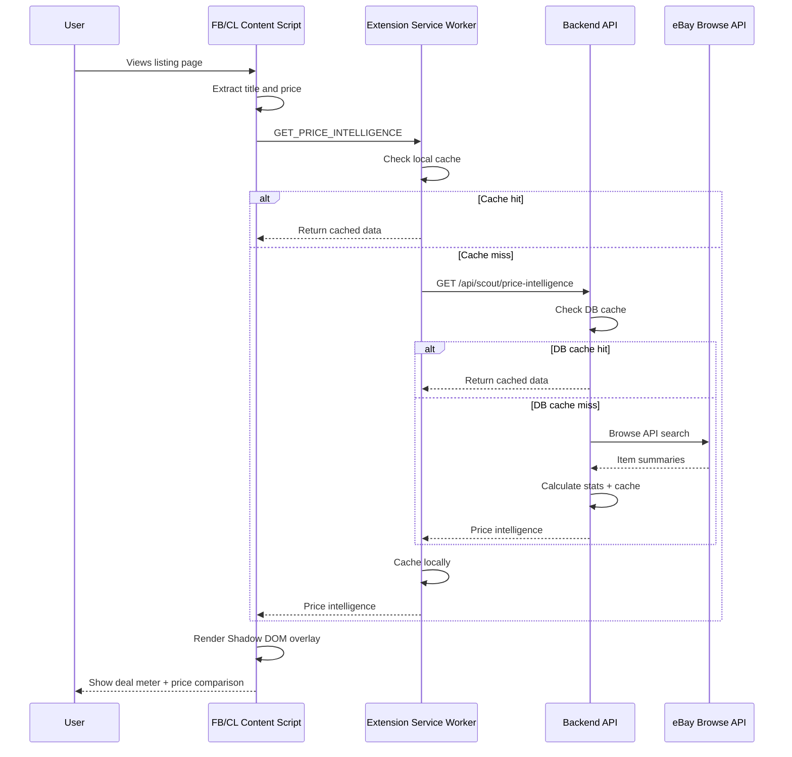
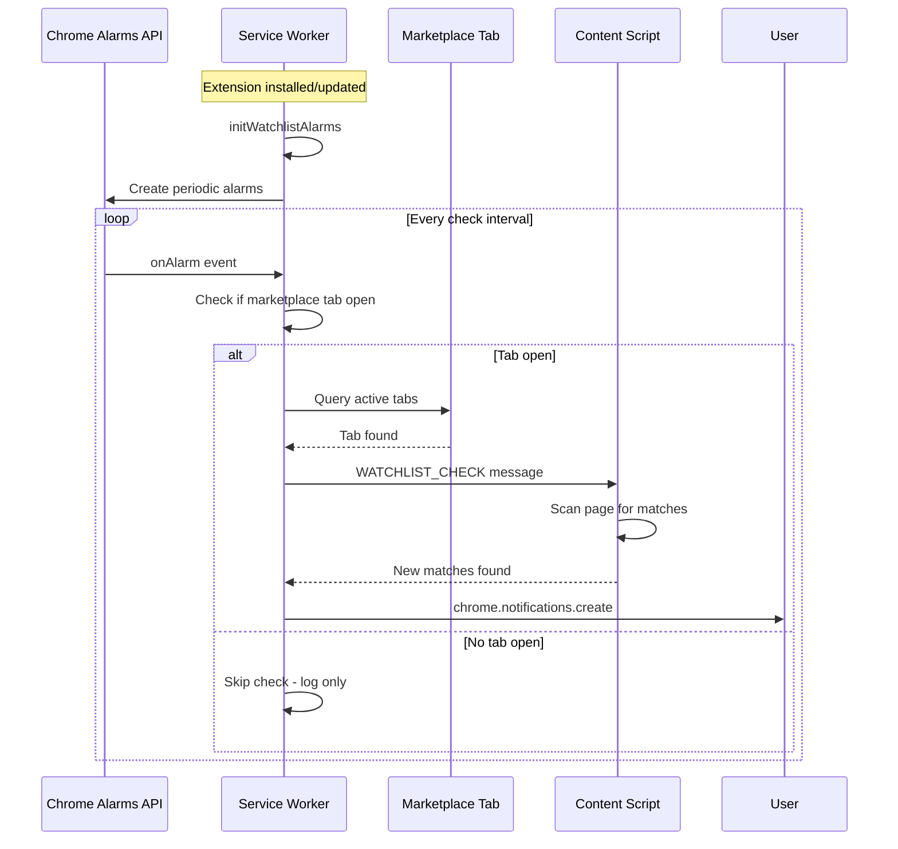

# 🔍 Smart Scout Implementation Plan

> **Strategic Pivot**: Transform from a "Cross-Posting Tool" to a **"Complete Marketplace Intelligence Platform"** that helps users both **sell smarter** (existing features) AND **buy smarter** (new Smart Scout features).

---

## Executive Summary

This document outlines the integration plan for "Smart Scout" - an intelligent marketplace assistant that provides real-time price intelligence, passive deal monitoring, and rapid buyer outreach capabilities. The implementation builds upon the existing Local Marketplace Lister extension architecture while maintaining full ToS compliance.

### Value Proposition Comparison

| Aspect | Existing App (Seller Focus) | Smart Scout Addition (Buyer Focus) |
|--------|------------------------------|-----------------------------------|
| **Core Action** | Cross-post listings to FB/CL | Market context overlay & deal alerts |
| **Value Prop** | Save time listing items | Information advantage (know true value) |
| **User Interaction** | Dashboard-driven posting | Active assistant on marketplace pages |
| **Risk Profile** | Controlled automation | Low (standard APIs, non-intrusive) |

---

## Part 1: Architecture Overview

### 1.1 Current State Analysis

```
┌─────────────────────────────────────────────────────────────────────────────┐
│                        CURRENT ARCHITECTURE                                  │
├─────────────────────────────────────────────────────────────────────────────┤
│                                                                             │
│  ┌─────────────┐     ┌─────────────┐     ┌─────────────────────────────┐   │
│  │  Frontend   │────▶│   Backend   │────▶│        Supabase            │   │
│  │   (React)   │     │  (Express)  │     │  (PostgreSQL + Storage)    │   │
│  └─────────────┘     └─────────────┘     └─────────────────────────────┘   │
│         │                                                                   │
│         │ postMessage                                                       │
│         ▼                                                                   │
│  ┌─────────────────────────────────────────────────────────────────────┐   │
│  │                    CHROME EXTENSION (MV3)                            │   │
│  │  ┌─────────────┐  ┌─────────────┐  ┌─────────────┐                  │   │
│  │  │   Bridge    │  │  Facebook   │  │  Craigslist │                  │   │
│  │  │   Script    │  │   Content   │  │   Content   │                  │   │
│  │  │ (dashboard) │  │   Script    │  │   Script    │                  │   │
│  │  └─────────────┘  └─────────────┘  └─────────────┘                  │   │
│  │         │                │                │                          │   │
│  │         └────────────────┼────────────────┘                          │   │
│  │                          ▼                                           │   │
│  │              ┌─────────────────────┐                                 │   │
│  │              │   Service Worker    │                                 │   │
│  │              │  - State Management │                                 │   │
│  │              │  - Tab Orchestration│                                 │   │
│  │              └─────────────────────┘                                 │   │
│  └─────────────────────────────────────────────────────────────────────┘   │
│                                                                             │
└─────────────────────────────────────────────────────────────────────────────┘
```

### 1.2 Smart Scout Enhanced Architecture

```
┌─────────────────────────────────────────────────────────────────────────────┐
│                      SMART SCOUT ENHANCED ARCHITECTURE                       │
├─────────────────────────────────────────────────────────────────────────────┤
│                                                                             │
│  ┌─────────────┐     ┌─────────────┐     ┌─────────────────────────────┐   │
│  │  Frontend   │────▶│   Backend   │────▶│        Supabase            │   │
│  │   (React)   │     │  (Express)  │     │  + watchlist_searches      │   │
│  │ + Watchlist │     │ + eBay Proxy│     │  + price_intelligence      │   │
│  │   Manager   │     │   Service   │     │  + market_comparisons      │   │
│  └─────────────┘     └─────────────┘     └─────────────────────────────┘   │
│         │                   │                                               │
│         │                   │ eBay Browse API                               │
│         │                   ▼                                               │
│         │            ┌─────────────┐                                       │
│         │            │  eBay API   │                                       │
│         │            │  (5K+/day)  │                                       │
│         │            └─────────────┘                                       │
│         │                                                                   │
│  ┌─────────────────────────────────────────────────────────────────────┐   │
│  │                    CHROME EXTENSION (MV3)                            │   │
│  │                                                                      │   │
│  │  ┌─────────────────────────────────────────────────────────────┐    │   │
│  │  │                NEW: SMART SCOUT MODULE                       │    │   │
│  │  │  ┌─────────────┐  ┌─────────────┐  ┌─────────────┐          │    │   │
│  │  │  │  Price      │  │  Watchlist  │  │  Quick      │          │    │   │
│  │  │  │  Overlay    │  │  Monitor    │  │  Reply      │          │    │   │
│  │  │  │  Engine     │  │  (Alarms)   │  │  Chips      │          │    │   │
│  │  │  └─────────────┘  └─────────────┘  └─────────────┘          │    │   │
│  │  └─────────────────────────────────────────────────────────────┘    │   │
│  │                                                                      │   │
│  │  ┌─────────────┐  ┌─────────────┐  ┌─────────────┐                  │   │
│  │  │   Bridge    │  │  Facebook   │  │  Craigslist │                  │   │
│  │  │   Script    │  │   Scout     │  │   Scout     │  ◀── NEW         │   │
│  │  │ (dashboard) │  │   Content   │  │   Content   │                  │   │
│  │  └─────────────┘  └─────────────┘  └─────────────┘                  │   │
│  │         │                │                │                          │   │
│  │         └────────────────┼────────────────┘                          │   │
│  │                          ▼                                           │   │
│  │  ┌─────────────────────────────────────────────────────────────┐    │   │
│  │  │                    SERVICE WORKER                            │    │   │
│  │  │  ┌─────────────┐  ┌─────────────┐  ┌─────────────┐          │    │   │
│  │  │  │  Existing   │  │  eBay API   │  │  Alarms     │          │    │   │
│  │  │  │  Posting    │  │  Proxy      │  │  Manager    │          │    │   │
│  │  │  │  Logic      │  │  (NEW)      │  │  (NEW)      │          │    │   │
│  │  │  └─────────────┘  └─────────────┘  └─────────────┘          │    │   │
│  │  └─────────────────────────────────────────────────────────────┘    │   │
│  │                                                                      │   │
│  └─────────────────────────────────────────────────────────────────────┘   │
│                                                                             │
└─────────────────────────────────────────────────────────────────────────────┘
```

---

## Part 2: Database Schema Additions

### 2.1 New Tables

```sql
-- Migration: 20251210000001_smart_scout_tables.sql

-- Watchlist Searches: User-saved keyword monitors
CREATE TABLE IF NOT EXISTS public.watchlist_searches (
    id UUID DEFAULT extensions.uuid_generate_v4() PRIMARY KEY,
    user_id UUID NOT NULL REFERENCES public.profiles(id) ON DELETE CASCADE,
    
    -- Search Configuration
    keywords TEXT NOT NULL,
    platforms TEXT[] DEFAULT ARRAY['facebook', 'craigslist'],
    max_price NUMERIC(10,2),
    min_price NUMERIC(10,2),
    location TEXT,
    radius_miles INTEGER DEFAULT 25,
    
    -- Notification Settings
    notification_enabled BOOLEAN DEFAULT true,
    notification_sound BOOLEAN DEFAULT false,
    check_interval_minutes INTEGER DEFAULT 30, -- Min 15, enforced in app
    
    -- State
    is_active BOOLEAN DEFAULT true,
    last_checked_at TIMESTAMP WITH TIME ZONE,
    total_matches INTEGER DEFAULT 0,
    created_at TIMESTAMP WITH TIME ZONE DEFAULT NOW(),
    updated_at TIMESTAMP WITH TIME ZONE DEFAULT NOW()
);

CREATE INDEX idx_watchlist_user ON public.watchlist_searches(user_id);
CREATE INDEX idx_watchlist_active ON public.watchlist_searches(is_active);

-- Price Intelligence: Cached eBay comparison data
CREATE TABLE IF NOT EXISTS public.price_intelligence (
    id UUID DEFAULT extensions.uuid_generate_v4() PRIMARY KEY,
    
    -- Query Info
    search_query TEXT NOT NULL,
    normalized_query TEXT NOT NULL, -- Lowercased, cleaned for caching
    
    -- eBay Data
    ebay_avg_price NUMERIC(10,2),
    ebay_low_price NUMERIC(10,2),
    ebay_high_price NUMERIC(10,2),
    ebay_sold_count INTEGER,
    ebay_active_count INTEGER,
    ebay_sample_listings JSONB DEFAULT '[]', -- Top 5 examples
    
    -- Cache Control
    fetched_at TIMESTAMP WITH TIME ZONE DEFAULT NOW(),
    expires_at TIMESTAMP WITH TIME ZONE DEFAULT (NOW() + INTERVAL '24 hours'),
    
    CONSTRAINT unique_normalized_query UNIQUE (normalized_query)
);

CREATE INDEX idx_price_intel_query ON public.price_intelligence(normalized_query);
CREATE INDEX idx_price_intel_expires ON public.price_intelligence(expires_at);

-- Market Comparisons: User-saved deal analyses
CREATE TABLE IF NOT EXISTS public.market_comparisons (
    id UUID DEFAULT extensions.uuid_generate_v4() PRIMARY KEY,
    user_id UUID NOT NULL REFERENCES public.profiles(id) ON DELETE CASCADE,
    
    -- Source Listing Info
    platform TEXT NOT NULL,
    platform_listing_url TEXT NOT NULL,
    listing_title TEXT NOT NULL,
    listing_price NUMERIC(10,2) NOT NULL,
    listing_image_url TEXT,
    
    -- Comparison Results
    price_intelligence_id UUID REFERENCES public.price_intelligence(id),
    spread_amount NUMERIC(10,2), -- Positive = potential profit
    spread_percentage NUMERIC(5,2),
    deal_score INTEGER, -- 1-100 rating
    
    -- User Actions
    is_bookmarked BOOLEAN DEFAULT false,
    user_notes TEXT,
    status TEXT DEFAULT 'new', -- new, contacted, purchased, passed
    
    created_at TIMESTAMP WITH TIME ZONE DEFAULT NOW(),
    updated_at TIMESTAMP WITH TIME ZONE DEFAULT NOW()
);

CREATE INDEX idx_market_comp_user ON public.market_comparisons(user_id);
CREATE INDEX idx_market_comp_status ON public.market_comparisons(status);

-- Watchlist Match History: Tracks found items for deduplication
CREATE TABLE IF NOT EXISTS public.watchlist_matches (
    id UUID DEFAULT extensions.uuid_generate_v4() PRIMARY KEY,
    watchlist_id UUID NOT NULL REFERENCES public.watchlist_searches(id) ON DELETE CASCADE,
    
    -- Match Info
    platform TEXT NOT NULL,
    platform_listing_id TEXT NOT NULL, -- FB/CL internal ID if available
    platform_listing_url TEXT NOT NULL,
    listing_title TEXT NOT NULL,
    listing_price NUMERIC(10,2),
    listing_image_url TEXT,
    
    -- Notification
    notified_at TIMESTAMP WITH TIME ZONE,
    
    -- User Action
    is_dismissed BOOLEAN DEFAULT false,
    
    found_at TIMESTAMP WITH TIME ZONE DEFAULT NOW(),
    
    CONSTRAINT unique_watchlist_listing UNIQUE (watchlist_id, platform, platform_listing_id)
);

CREATE INDEX idx_watchlist_matches_watchlist ON public.watchlist_matches(watchlist_id);

-- RLS Policies
ALTER TABLE public.watchlist_searches ENABLE ROW LEVEL SECURITY;
ALTER TABLE public.price_intelligence ENABLE ROW LEVEL SECURITY;
ALTER TABLE public.market_comparisons ENABLE ROW LEVEL SECURITY;
ALTER TABLE public.watchlist_matches ENABLE ROW LEVEL SECURITY;

-- User policies
CREATE POLICY "Users can manage their own watchlist searches" 
    ON public.watchlist_searches 
    USING (auth.uid() = user_id);

CREATE POLICY "Price intelligence is readable by all authenticated users" 
    ON public.price_intelligence 
    FOR SELECT 
    TO authenticated 
    USING (true);

CREATE POLICY "Service role can manage price intelligence" 
    ON public.price_intelligence 
    TO service_role 
    USING (true) 
    WITH CHECK (true);

CREATE POLICY "Users can manage their own market comparisons" 
    ON public.market_comparisons 
    USING (auth.uid() = user_id);

CREATE POLICY "Users can view matches for their watchlists" 
    ON public.watchlist_matches 
    FOR SELECT 
    USING (EXISTS (
        SELECT 1 FROM public.watchlist_searches 
        WHERE id = watchlist_matches.watchlist_id 
        AND user_id = auth.uid()
    ));

-- Triggers
CREATE TRIGGER update_watchlist_searches_updated_at 
    BEFORE UPDATE ON public.watchlist_searches 
    FOR EACH ROW EXECUTE FUNCTION public.update_updated_at_column();

CREATE TRIGGER update_market_comparisons_updated_at 
    BEFORE UPDATE ON public.market_comparisons 
    FOR EACH ROW EXECUTE FUNCTION public.update_updated_at_column();
```

---

## Part 3: Extension Architecture Changes

### 3.1 Updated Manifest (manifest.json)

```json
{
  "manifest_version": 3,
  "name": "Local Marketplace Lister + Smart Scout",
  "version": "2.0.0",
  "description": "Cross-list your items AND discover deals with real-time price intelligence.",
  "permissions": [
    "scripting",
    "activeTab",
    "storage",
    "unlimitedStorage",
    "tabs",
    "alarms",
    "notifications"
  ],
  "host_permissions": [
    "*://*.facebook.com/*",
    "*://*.craigslist.org/*",
    "*://*.offerup.com/*",
    "*://*.supabase.co/*",
    "*://*.onrender.com/*",
    "*://api.ebay.com/*",
    "*://api.sandbox.ebay.com/*"
  ],
  "action": {
    "default_popup": "src/popup/popup.html",
    "default_icon": {
      "16": "assets/icon-16.png",
      "48": "assets/icon-48.png",
      "128": "assets/icon-128.png"
    }
  },
  "background": {
    "service_worker": "src/background/service-worker.js",
    "type": "module"
  },
  "content_scripts": [
    {
      "matches": ["*://*.craigslist.org/*"],
      "js": ["src/content/craigslist.js", "src/content/scout/craigslist-scout.js"],
      "css": ["src/content/scout/overlay.css"]
    },
    {
      "matches": ["*://*.facebook.com/*"],
      "js": ["src/content/facebook.js", "src/content/scout/facebook-scout.js"],
      "css": ["src/content/scout/overlay.css"]
    },
    {
      "matches": [
        "http://localhost/*",
        "http://127.0.0.1/*",
        "https://*.onrender.com/*"
      ],
      "js": ["src/content/bridge.js"]
    }
  ],
  "web_accessible_resources": [
    {
      "resources": ["src/content/scout/overlay-component.js", "assets/*"],
      "matches": ["*://*.facebook.com/*", "*://*.craigslist.org/*"]
    }
  ]
}
```

### 3.2 Service Worker Additions

**New file: `extension/src/background/ebay-api.js`**

```javascript
// eBay API Integration Module
// Called from service worker to fetch price comparisons

const EBAY_APP_ID = 'YOUR_EBAY_APP_ID'; // Will be stored in extension options
const EBAY_API_BASE = 'https://api.ebay.com';

// OAuth2 Client Credentials flow for eBay
let cachedToken = null;
let tokenExpiry = null;

async function getAccessToken() {
  if (cachedToken && tokenExpiry && Date.now() < tokenExpiry) {
    return cachedToken;
  }

  const { ebayAppId, ebayCertId } = await chrome.storage.sync.get(['ebayAppId', 'ebayCertId']);
  
  if (!ebayAppId || !ebayCertId) {
    throw new Error('eBay API credentials not configured');
  }

  const credentials = btoa(`${ebayAppId}:${ebayCertId}`);
  
  const response = await fetch('https://api.ebay.com/identity/v1/oauth2/token', {
    method: 'POST',
    headers: {
      'Content-Type': 'application/x-www-form-urlencoded',
      'Authorization': `Basic ${credentials}`
    },
    body: 'grant_type=client_credentials&scope=https://api.ebay.com/oauth/api_scope'
  });

  if (!response.ok) {
    throw new Error(`eBay auth failed: ${response.status}`);
  }

  const data = await response.json();
  cachedToken = data.access_token;
  tokenExpiry = Date.now() + (data.expires_in - 60) * 1000; // Refresh 1 min early
  
  return cachedToken;
}

export async function searchEbaySoldItems(query, options = {}) {
  const token = await getAccessToken();
  
  const params = new URLSearchParams({
    q: query,
    limit: options.limit || 20,
    filter: 'buyingOptions:{FIXED_PRICE|AUCTION},conditions:{NEW|LIKE_NEW|GOOD|FAIR}'
  });

  // Note: Browse API shows active listings. For "sold" data, we need:
  // Option A: Use Finding API with soldItemsOnly filter (legacy)
  // Option B: Compare against active listings and estimate
  // For MVP, we use active listings as "market price" reference
  
  const response = await fetch(
    `${EBAY_API_BASE}/buy/browse/v1/item_summary/search?${params}`,
    {
      headers: {
        'Authorization': `Bearer ${token}`,
        'X-EBAY-C-MARKETPLACE-ID': 'EBAY_US',
        'Content-Type': 'application/json'
      }
    }
  );

  if (!response.ok) {
    throw new Error(`eBay search failed: ${response.status}`);
  }

  const data = await response.json();
  return processEbayResults(data.itemSummaries || []);
}

function processEbayResults(items) {
  if (!items.length) {
    return { found: false };
  }

  const prices = items
    .filter(item => item.price?.value)
    .map(item => parseFloat(item.price.value));

  if (!prices.length) {
    return { found: false };
  }

  const sorted = [...prices].sort((a, b) => a - b);
  
  return {
    found: true,
    avgPrice: prices.reduce((a, b) => a + b, 0) / prices.length,
    lowPrice: sorted[0],
    highPrice: sorted[sorted.length - 1],
    medianPrice: sorted[Math.floor(sorted.length / 2)],
    count: items.length,
    samples: items.slice(0, 5).map(item => ({
      title: item.title,
      price: parseFloat(item.price?.value || 0),
      image: item.image?.imageUrl,
      url: item.itemWebUrl,
      condition: item.condition
    }))
  };
}

export async function getPriceIntelligence(query) {
  // Check local cache first
  const cacheKey = `price_intel_${query.toLowerCase().trim()}`;
  const cached = await chrome.storage.local.get([cacheKey]);
  
  if (cached[cacheKey] && cached[cacheKey].expiresAt > Date.now()) {
    return cached[cacheKey].data;
  }

  // Fetch from eBay
  const result = await searchEbaySoldItems(query);
  
  // Cache for 24 hours
  await chrome.storage.local.set({
    [cacheKey]: {
      data: result,
      expiresAt: Date.now() + 24 * 60 * 60 * 1000
    }
  });

  return result;
}
```

### 3.3 Alarms Manager for Watchlist

**New file: `extension/src/background/watchlist-manager.js`**

```javascript
// Watchlist Monitoring Module
// Uses chrome.alarms API for scheduled checks

const MIN_CHECK_INTERVAL = 15; // minutes
const ALARM_NAME_PREFIX = 'watchlist_check_';

export async function initWatchlistAlarms() {
  // Clear any stale alarms on startup
  const alarms = await chrome.alarms.getAll();
  for (const alarm of alarms) {
    if (alarm.name.startsWith(ALARM_NAME_PREFIX)) {
      await chrome.alarms.clear(alarm.name);
    }
  }

  // Set up alarms for active watchlist items
  const { watchlistItems } = await chrome.storage.local.get(['watchlistItems']);
  
  if (watchlistItems && Array.isArray(watchlistItems)) {
    for (const item of watchlistItems.filter(w => w.isActive)) {
      scheduleWatchlistCheck(item);
    }
  }
}

export function scheduleWatchlistCheck(watchlistItem) {
  const interval = Math.max(watchlistItem.checkIntervalMinutes || 30, MIN_CHECK_INTERVAL);
  
  chrome.alarms.create(`${ALARM_NAME_PREFIX}${watchlistItem.id}`, {
    periodInMinutes: interval,
    delayInMinutes: 1 // First check after 1 minute
  });
}

export async function handleWatchlistAlarm(alarmName) {
  const watchlistId = alarmName.replace(ALARM_NAME_PREFIX, '');
  
  const { watchlistItems } = await chrome.storage.local.get(['watchlistItems']);
  const watchlist = watchlistItems?.find(w => w.id === watchlistId);
  
  if (!watchlist || !watchlist.isActive) {
    await chrome.alarms.clear(alarmName);
    return;
  }

  console.log(`Checking watchlist: ${watchlist.keywords}`);
  
  // This is where the "Dashboard Tab" strategy comes in
  // We cannot easily fetch FB/CL search results from background due to auth
  // Instead, we'll notify the user or use a pinned tab approach
  
  await checkWatchlistViaDashboardTab(watchlist);
}

async function checkWatchlistViaDashboardTab(watchlist) {
  // Strategy: Look for an existing marketplace tab or notify user
  const tabs = await chrome.tabs.query({
    url: watchlist.platforms.includes('facebook') 
      ? '*://*.facebook.com/marketplace/*' 
      : '*://*.craigslist.org/*'
  });

  if (tabs.length > 0) {
    // Send message to content script to check for new items
    chrome.tabs.sendMessage(tabs[0].id, {
      action: 'WATCHLIST_CHECK',
      watchlist
    });
  } else {
    // No active tab - we could:
    // A) Skip this check (safest)
    // B) Open a tab briefly (more aggressive)
    // C) Store for next time user opens marketplace
    
    // For MVP, we go with option A and just log it
    console.log('No marketplace tab open for watchlist check');
  }
}

// Listen for alarm events
chrome.alarms.onAlarm.addListener((alarm) => {
  if (alarm.name.startsWith(ALARM_NAME_PREFIX)) {
    handleWatchlistAlarm(alarm.name);
  }
});
```

### 3.4 Content Script Scout Module

**New file: `extension/src/content/scout/facebook-scout.js`**

```javascript
// Facebook Marketplace Scout - Price Intelligence Overlay
// Injects into FB Marketplace listing pages

(function() {
  'use strict';

  const SCOUT_CONTAINER_ID = 'smart-scout-overlay';
  let currentListingData = null;
  let overlayElement = null;

  // Initialize on page load
  function init() {
    // Check if we're on a marketplace listing page
    if (!isMarketplaceListingPage()) {
      return;
    }

    // Wait for listing content to load
    observeListingContent();
  }

  function isMarketplaceListingPage() {
    return window.location.href.includes('/marketplace/item/');
  }

  function observeListingContent() {
    // Use MutationObserver to detect when listing data is loaded
    const observer = new MutationObserver((mutations, obs) => {
      const listingData = extractListingData();
      
      if (listingData && listingData.title) {
        obs.disconnect();
        currentListingData = listingData;
        requestPriceIntelligence(listingData);
      }
    });

    observer.observe(document.body, {
      childList: true,
      subtree: true
    });

    // Also try immediately
    const listingData = extractListingData();
    if (listingData && listingData.title) {
      currentListingData = listingData;
      requestPriceIntelligence(listingData);
    }
  }

  function extractListingData() {
    // Facebook uses dynamic classes, so we rely on semantic structure
    // Title is usually in the first h1 or specific span with role
    const titleEl = document.querySelector('h1') || 
                    document.querySelector('[data-testid="marketplace_pdp_title"]') ||
                    document.querySelector('span[dir="auto"]');
    
    // Price - look for currency patterns
    const priceEl = document.querySelector('[data-testid="marketplace_pdp_price"]') ||
                    findElementByContent(/^\$[\d,]+/);
    
    if (!titleEl) return null;

    return {
      title: titleEl.textContent.trim(),
      price: priceEl ? parsePrice(priceEl.textContent) : null,
      url: window.location.href,
      platform: 'facebook'
    };
  }

  function findElementByContent(regex) {
    const walker = document.createTreeWalker(
      document.body,
      NodeFilter.SHOW_TEXT,
      null,
      false
    );

    while (walker.nextNode()) {
      if (regex.test(walker.currentNode.textContent.trim())) {
        return walker.currentNode.parentElement;
      }
    }
    return null;
  }

  function parsePrice(priceStr) {
    if (!priceStr) return null;
    const match = priceStr.match(/[\d,]+\.?\d*/);
    return match ? parseFloat(match[0].replace(',', '')) : null;
  }

  function requestPriceIntelligence(listingData) {
    // Send to service worker for eBay API lookup
    chrome.runtime.sendMessage({
      action: 'GET_PRICE_INTELLIGENCE',
      query: listingData.title,
      currentPrice: listingData.price
    }, (response) => {
      if (chrome.runtime.lastError) {
        console.warn('Scout: Error getting price intelligence:', chrome.runtime.lastError);
        return;
      }
      
      if (response && response.found) {
        renderOverlay(listingData, response);
      }
    });
  }

  function renderOverlay(listing, priceData) {
    // Remove existing overlay if any
    if (overlayElement) {
      overlayElement.remove();
    }

    // Create Shadow DOM container for style isolation
    const container = document.createElement('div');
    container.id = SCOUT_CONTAINER_ID;
    container.style.cssText = `
      position: fixed;
      bottom: 20px;
      right: 20px;
      z-index: 999999;
    `;

    const shadow = container.attachShadow({ mode: 'open' });
    
    // Calculate deal metrics
    const spread = listing.price ? (priceData.avgPrice - listing.price) : null;
    const spreadPct = listing.price ? ((spread / listing.price) * 100) : null;
    const dealRating = calculateDealRating(listing.price, priceData);

    // Render card
    shadow.innerHTML = `
      <style>
        .scout-card {
          background: linear-gradient(135deg, #1a1a2e 0%, #16213e 100%);
          border-radius: 16px;
          padding: 16px 20px;
          min-width: 280px;
          box-shadow: 0 10px 40px rgba(0, 0, 0, 0.4);
          font-family: -apple-system, BlinkMacSystemFont, 'Segoe UI', Roboto, sans-serif;
          color: #fff;
          border: 1px solid rgba(255, 255, 255, 0.1);
        }
        .scout-header {
          display: flex;
          align-items: center;
          gap: 8px;
          margin-bottom: 12px;
          font-size: 12px;
          color: #94a3b8;
          text-transform: uppercase;
          letter-spacing: 0.5px;
        }
        .scout-header svg {
          width: 16px;
          height: 16px;
        }
        .price-row {
          display: flex;
          justify-content: space-between;
          align-items: center;
          margin-bottom: 8px;
        }
        .price-label {
          color: #94a3b8;
          font-size: 13px;
        }
        .price-value {
          font-size: 18px;
          font-weight: 600;
        }
        .ebay-price {
          color: #60a5fa;
        }
        .spread-positive {
          color: #4ade80;
        }
        .spread-negative {
          color: #f87171;
        }
        .deal-meter {
          margin-top: 12px;
          padding-top: 12px;
          border-top: 1px solid rgba(255, 255, 255, 0.1);
        }
        .meter-bar {
          height: 6px;
          background: #374151;
          border-radius: 3px;
          overflow: hidden;
        }
        .meter-fill {
          height: 100%;
          border-radius: 3px;
          transition: width 0.3s ease;
        }
        .meter-fill.good { background: linear-gradient(90deg, #4ade80, #22c55e); }
        .meter-fill.okay { background: linear-gradient(90deg, #facc15, #eab308); }
        .meter-fill.poor { background: linear-gradient(90deg, #f87171, #ef4444); }
        .deal-label {
          font-size: 12px;
          color: #94a3b8;
          margin-top: 6px;
          text-align: center;
        }
        .scout-link {
          display: block;
          text-align: center;
          margin-top: 12px;
          color: #60a5fa;
          font-size: 12px;
          text-decoration: none;
          opacity: 0.8;
          transition: opacity 0.2s;
        }
        .scout-link:hover {
          opacity: 1;
          text-decoration: underline;
        }
        .close-btn {
          position: absolute;
          top: 8px;
          right: 8px;
          background: none;
          border: none;
          color: #64748b;
          cursor: pointer;
          padding: 4px;
          font-size: 18px;
          line-height: 1;
        }
        .close-btn:hover {
          color: #94a3b8;
        }
      </style>
      
      <div class="scout-card" style="position: relative;">
        <button class="close-btn" title="Close">&times;</button>
        
        <div class="scout-header">
          <svg viewBox="0 0 24 24" fill="none" stroke="currentColor" stroke-width="2">
            <circle cx="11" cy="11" r="8"/>
            <path d="M21 21l-4.35-4.35"/>
          </svg>
          Smart Scout Price Check
        </div>
        
        <div class="price-row">
          <span class="price-label">eBay Avg:</span>
          <span class="price-value ebay-price">$${priceData.avgPrice.toFixed(0)}</span>
        </div>
        
        <div class="price-row">
          <span class="price-label">eBay Range:</span>
          <span class="price-value" style="font-size: 14px; color: #94a3b8;">
            $${priceData.lowPrice.toFixed(0)} - $${priceData.highPrice.toFixed(0)}
          </span>
        </div>
        
        ${listing.price ? `
          <div class="price-row">
            <span class="price-label">Spread:</span>
            <span class="price-value ${spread >= 0 ? 'spread-positive' : 'spread-negative'}">
              ${spread >= 0 ? '+' : ''}$${Math.abs(spread).toFixed(0)} 
              (${spreadPct >= 0 ? '+' : ''}${spreadPct.toFixed(0)}%)
            </span>
          </div>
          
          <div class="deal-meter">
            <div class="meter-bar">
              <div class="meter-fill ${dealRating >= 70 ? 'good' : dealRating >= 40 ? 'okay' : 'poor'}" 
                   style="width: ${dealRating}%"></div>
            </div>
            <div class="deal-label">
              ${dealRating >= 70 ? '🔥 Great Deal!' : dealRating >= 40 ? '👍 Fair Price' : '⚠️ Above Market'}
            </div>
          </div>
        ` : ''}
        
        <a class="scout-link" 
           href="https://www.ebay.com/sch/i.html?_nkw=${encodeURIComponent(listing.title)}&LH_Sold=1&LH_Complete=1" 
           target="_blank">
          View sold comps on eBay →
        </a>
      </div>
    `;

    // Add close button handler
    shadow.querySelector('.close-btn').addEventListener('click', () => {
      container.remove();
    });

    document.body.appendChild(container);
    overlayElement = container;
  }

  function calculateDealRating(askingPrice, priceData) {
    if (!askingPrice) return 50;
    
    // Rating based on how asking compares to market
    // Below avg = good, at avg = okay, above avg = poor
    const ratio = askingPrice / priceData.avgPrice;
    
    if (ratio <= 0.5) return 95;      // 50% or less of market: amazing
    if (ratio <= 0.7) return 85;      // 70%: great
    if (ratio <= 0.85) return 70;     // 85%: good
    if (ratio <= 1.0) return 50;      // at market: fair
    if (ratio <= 1.15) return 35;     // 15% above: meh
    if (ratio <= 1.3) return 20;      // 30% above: overpriced
    return 10;                        // 30%+ above: avoid
  }

  // Initialize
  if (document.readyState === 'loading') {
    document.addEventListener('DOMContentLoaded', init);
  } else {
    init();
  }

  // Handle SPA navigation (Facebook is React-based)
  let lastUrl = location.href;
  new MutationObserver(() => {
    if (location.href !== lastUrl) {
      lastUrl = location.href;
      if (overlayElement) {
        overlayElement.remove();
        overlayElement = null;
      }
      init();
    }
  }).observe(document, { subtree: true, childList: true });

})();
```

### 3.5 Quick Reply Chips

**Addition to `extension/src/content/scout/facebook-scout.js`**

```javascript
// Quick Reply Chip Injection
function injectQuickReplyChips() {
  // Find the message input area
  const messageBox = document.querySelector('[aria-label="Message"]') ||
                     document.querySelector('textarea[placeholder*="Message"]');
  
  if (!messageBox || document.getElementById('scout-quick-replies')) {
    return;
  }

  const chipContainer = document.createElement('div');
  chipContainer.id = 'scout-quick-replies';
  chipContainer.style.cssText = `
    display: flex;
    gap: 8px;
    margin-bottom: 8px;
    flex-wrap: wrap;
  `;

  const quickMessages = [
    { label: 'Is it available?', text: 'Hi! Is this still available?' },
    { label: 'Pick up today?', text: 'Hi! I can pick up today if available. What times work for you?' },
    { label: 'Cash ready', text: 'Hi! Interested and have cash ready. Is this still available?' },
    { label: 'Bundle deal?', text: 'Hi! Would you consider a discount if I buy multiple items?' }
  ];

  quickMessages.forEach(({ label, text }) => {
    const chip = document.createElement('button');
    chip.textContent = label;
    chip.style.cssText = `
      background: #3b82f6;
      color: white;
      border: none;
      border-radius: 16px;
      padding: 6px 12px;
      font-size: 12px;
      cursor: pointer;
      transition: background 0.2s;
    `;
    chip.addEventListener('mouseenter', () => chip.style.background = '#2563eb');
    chip.addEventListener('mouseleave', () => chip.style.background = '#3b82f6');
    chip.addEventListener('click', () => {
      fillMessageBox(messageBox, text);
    });
    chipContainer.appendChild(chip);
  });

  // Insert before the message box
  messageBox.parentElement.insertBefore(chipContainer, messageBox);
}

function fillMessageBox(input, text) {
  // React state hack: dispatch proper events so React registers the change
  const nativeInputValueSetter = Object.getOwnPropertyDescriptor(
    window.HTMLTextAreaElement.prototype, 
    'value'
  ).set;
  
  nativeInputValueSetter.call(input, text);
  
  // Dispatch input event to trigger React's onChange
  input.dispatchEvent(new Event('input', { bubbles: true }));
  
  // Focus the input
  input.focus();
}

// Observer to inject chips when message modal opens
const messageModalObserver = new MutationObserver(() => {
  injectQuickReplyChips();
});

messageModalObserver.observe(document.body, {
  childList: true,
  subtree: true
});
```

---

## Part 4: Backend API Additions

### 4.1 New Routes

**File: `backend/src/routes/scout.routes.ts`**

```typescript
import { Router } from 'express';
import { authMiddleware } from '../middleware/auth.middleware';
import { ScoutService } from '../services/scout.service';

const router = Router();
const scoutService = new ScoutService();

// Watchlist Management
router.get('/watchlist', authMiddleware, async (req, res, next) => {
  try {
    const watchlists = await scoutService.getUserWatchlists(req.user.id);
    res.json({ success: true, data: watchlists });
  } catch (error) {
    next(error);
  }
});

router.post('/watchlist', authMiddleware, async (req, res, next) => {
  try {
    const watchlist = await scoutService.createWatchlist(req.user.id, req.body);
    res.json({ success: true, data: watchlist });
  } catch (error) {
    next(error);
  }
});

router.put('/watchlist/:id', authMiddleware, async (req, res, next) => {
  try {
    const watchlist = await scoutService.updateWatchlist(req.params.id, req.user.id, req.body);
    res.json({ success: true, data: watchlist });
  } catch (error) {
    next(error);
  }
});

router.delete('/watchlist/:id', authMiddleware, async (req, res, next) => {
  try {
    await scoutService.deleteWatchlist(req.params.id, req.user.id);
    res.json({ success: true });
  } catch (error) {
    next(error);
  }
});

// Price Intelligence (Proxy for extension)
router.get('/price-intelligence', authMiddleware, async (req, res, next) => {
  try {
    const query = req.query.q as string;
    if (!query) {
      return res.status(400).json({ success: false, error: 'Query required' });
    }
    
    const data = await scoutService.getPriceIntelligence(query);
    res.json({ success: true, data });
  } catch (error) {
    next(error);
  }
});

// Market Comparisons (saved deals)
router.get('/comparisons', authMiddleware, async (req, res, next) => {
  try {
    const comparisons = await scoutService.getUserComparisons(req.user.id);
    res.json({ success: true, data: comparisons });
  } catch (error) {
    next(error);
  }
});

router.post('/comparisons', authMiddleware, async (req, res, next) => {
  try {
    const comparison = await scoutService.saveComparison(req.user.id, req.body);
    res.json({ success: true, data: comparison });
  } catch (error) {
    next(error);
  }
});

export default router;
```

### 4.2 Scout Service

**File: `backend/src/services/scout.service.ts`**

```typescript
import { supabase } from '../config/supabase';
import EbayApi from 'ebay-api'; // npm install ebay-api

export class ScoutService {
  private ebay: any;

  constructor() {
    this.ebay = new EbayApi({
      appId: process.env.EBAY_APP_ID!,
      certId: process.env.EBAY_CERT_ID!,
      sandbox: false,
      marketplaceId: 'EBAY_US'
    });
  }

  // Watchlist Methods
  async getUserWatchlists(userId: string) {
    const { data, error } = await supabase
      .from('watchlist_searches')
      .select('*')
      .eq('user_id', userId)
      .order('created_at', { ascending: false });

    if (error) throw error;
    return data;
  }

  async createWatchlist(userId: string, watchlist: any) {
    const { data, error } = await supabase
      .from('watchlist_searches')
      .insert({
        user_id: userId,
        keywords: watchlist.keywords,
        platforms: watchlist.platforms || ['facebook', 'craigslist'],
        max_price: watchlist.maxPrice,
        min_price: watchlist.minPrice,
        location: watchlist.location,
        radius_miles: watchlist.radiusMiles || 25,
        check_interval_minutes: Math.max(watchlist.checkInterval || 30, 15)
      })
      .select()
      .single();

    if (error) throw error;
    return data;
  }

  async updateWatchlist(id: string, userId: string, updates: any) {
    const { data, error } = await supabase
      .from('watchlist_searches')
      .update({
        keywords: updates.keywords,
        platforms: updates.platforms,
        max_price: updates.maxPrice,
        min_price: updates.minPrice,
        is_active: updates.isActive,
        notification_enabled: updates.notificationEnabled,
        check_interval_minutes: Math.max(updates.checkInterval || 30, 15)
      })
      .eq('id', id)
      .eq('user_id', userId)
      .select()
      .single();

    if (error) throw error;
    return data;
  }

  async deleteWatchlist(id: string, userId: string) {
    const { error } = await supabase
      .from('watchlist_searches')
      .delete()
      .eq('id', id)
      .eq('user_id', userId);

    if (error) throw error;
  }

  // Price Intelligence Methods
  async getPriceIntelligence(query: string) {
    const normalizedQuery = query.toLowerCase().trim();
    
    // Check cache first
    const { data: cached } = await supabase
      .from('price_intelligence')
      .select('*')
      .eq('normalized_query', normalizedQuery)
      .gt('expires_at', new Date().toISOString())
      .single();

    if (cached) {
      return {
        found: true,
        avgPrice: cached.ebay_avg_price,
        lowPrice: cached.ebay_low_price,
        highPrice: cached.ebay_high_price,
        count: cached.ebay_sold_count,
        samples: cached.ebay_sample_listings,
        cached: true
      };
    }

    // Fetch from eBay
    try {
      const results = await this.ebay.buy.browse.search({
        q: query,
        limit: 50
      });

      const items = results.itemSummaries || [];
      
      if (!items.length) {
        return { found: false };
      }

      const prices = items
        .filter((item: any) => item.price?.value)
        .map((item: any) => parseFloat(item.price.value));

      const sorted = [...prices].sort((a: number, b: number) => a - b);
      const avgPrice = prices.reduce((a: number, b: number) => a + b, 0) / prices.length;

      const result = {
        found: true,
        avgPrice,
        lowPrice: sorted[0],
        highPrice: sorted[sorted.length - 1],
        count: items.length,
        samples: items.slice(0, 5).map((item: any) => ({
          title: item.title,
          price: parseFloat(item.price?.value || 0),
          image: item.image?.imageUrl,
          url: item.itemWebUrl
        }))
      };

      // Cache result
      await supabase.from('price_intelligence').upsert({
        search_query: query,
        normalized_query: normalizedQuery,
        ebay_avg_price: avgPrice,
        ebay_low_price: sorted[0],
        ebay_high_price: sorted[sorted.length - 1],
        ebay_sold_count: items.length,
        ebay_sample_listings: result.samples,
        expires_at: new Date(Date.now() + 24 * 60 * 60 * 1000).toISOString()
      }, {
        onConflict: 'normalized_query'
      });

      return result;
    } catch (error) {
      console.error('eBay API error:', error);
      throw error;
    }
  }

  // Market Comparisons
  async getUserComparisons(userId: string) {
    const { data, error } = await supabase
      .from('market_comparisons')
      .select(`
        *,
        price_intelligence (*)
      `)
      .eq('user_id', userId)
      .order('created_at', { ascending: false });

    if (error) throw error;
    return data;
  }

  async saveComparison(userId: string, comparison: any) {
    // Get or create price intelligence
    const priceData = await this.getPriceIntelligence(comparison.listingTitle);
    
    let priceIntelligenceId = null;
    if (priceData.found) {
      const { data: pi } = await supabase
        .from('price_intelligence')
        .select('id')
        .eq('normalized_query', comparison.listingTitle.toLowerCase().trim())
        .single();
      priceIntelligenceId = pi?.id;
    }

    const spread = priceData.found && comparison.listingPrice 
      ? priceData.avgPrice - comparison.listingPrice 
      : null;
    
    const spreadPct = spread && comparison.listingPrice 
      ? (spread / comparison.listingPrice) * 100 
      : null;

    const { data, error } = await supabase
      .from('market_comparisons')
      .insert({
        user_id: userId,
        platform: comparison.platform,
        platform_listing_url: comparison.listingUrl,
        listing_title: comparison.listingTitle,
        listing_price: comparison.listingPrice,
        listing_image_url: comparison.listingImage,
        price_intelligence_id: priceIntelligenceId,
        spread_amount: spread,
        spread_percentage: spreadPct,
        deal_score: this.calculateDealScore(comparison.listingPrice, priceData)
      })
      .select()
      .single();

    if (error) throw error;
    return data;
  }

  private calculateDealScore(askingPrice: number | null, priceData: any): number {
    if (!askingPrice || !priceData.found) return 50;
    
    const ratio = askingPrice / priceData.avgPrice;
    
    if (ratio <= 0.5) return 95;
    if (ratio <= 0.7) return 85;
    if (ratio <= 0.85) return 70;
    if (ratio <= 1.0) return 50;
    if (ratio <= 1.15) return 35;
    if (ratio <= 1.3) return 20;
    return 10;
  }
}
```

---

## Part 5: Frontend Additions

### 5.1 Watchlist Management Page

**File: `frontend/src/pages/Watchlist.tsx`**

```tsx
import React, { useState, useEffect } from 'react';
import { 
  Card, CardHeader, CardContent,
  Button, TextField, Switch, Chip,
  IconButton, Dialog, DialogTitle, DialogContent, DialogActions,
  Table, TableBody, TableCell, TableHead, TableRow,
  FormControlLabel, Checkbox, Slider, Alert
} from '@mui/material';
import { Add, Delete, Edit, Notifications, Search } from '@mui/icons-material';
import { scoutAPI } from '../services/api';

interface WatchlistItem {
  id: string;
  keywords: string;
  platforms: string[];
  maxPrice?: number;
  minPrice?: number;
  location?: string;
  radiusMiles: number;
  isActive: boolean;
  notificationEnabled: boolean;
  checkIntervalMinutes: number;
  totalMatches: number;
  lastCheckedAt?: string;
  createdAt: string;
}

export default function WatchlistPage() {
  const [watchlists, setWatchlists] = useState<WatchlistItem[]>([]);
  const [loading, setLoading] = useState(true);
  const [dialogOpen, setDialogOpen] = useState(false);
  const [editItem, setEditItem] = useState<WatchlistItem | null>(null);
  const [formData, setFormData] = useState({
    keywords: '',
    platforms: ['facebook', 'craigslist'],
    maxPrice: '',
    minPrice: '',
    location: '',
    radiusMiles: 25,
    checkIntervalMinutes: 30,
    notificationEnabled: true
  });

  useEffect(() => {
    fetchWatchlists();
  }, []);

  const fetchWatchlists = async () => {
    try {
      const data = await scoutAPI.getWatchlists();
      setWatchlists(data);
    } catch (err) {
      console.error('Failed to fetch watchlists:', err);
    } finally {
      setLoading(false);
    }
  };

  const handleSave = async () => {
    try {
      if (editItem) {
        await scoutAPI.updateWatchlist(editItem.id, formData);
      } else {
        await scoutAPI.createWatchlist(formData);
      }
      setDialogOpen(false);
      fetchWatchlists();
    } catch (err) {
      console.error('Failed to save watchlist:', err);
    }
  };

  const handleDelete = async (id: string) => {
    if (!confirm('Delete this watchlist?')) return;
    try {
      await scoutAPI.deleteWatchlist(id);
      fetchWatchlists();
    } catch (err) {
      console.error('Failed to delete:', err);
    }
  };

  const handleToggleActive = async (item: WatchlistItem) => {
    try {
      await scoutAPI.updateWatchlist(item.id, { isActive: !item.isActive });
      fetchWatchlists();
    } catch (err) {
      console.error('Failed to toggle:', err);
    }
  };

  return (
    <div className="container mx-auto p-6">
      <div className="flex justify-between items-center mb-6">
        <div>
          <h1 className="text-2xl font-bold">🔍 Smart Scout Watchlists</h1>
          <p className="text-gray-600">
            Monitor marketplaces for deals matching your keywords
          </p>
        </div>
        <Button 
          variant="contained" 
          startIcon={<Add />}
          onClick={() => {
            setEditItem(null);
            setFormData({
              keywords: '',
              platforms: ['facebook', 'craigslist'],
              maxPrice: '',
              minPrice: '',
              location: '',
              radiusMiles: 25,
              checkIntervalMinutes: 30,
              notificationEnabled: true
            });
            setDialogOpen(true);
          }}
        >
          Add Watchlist
        </Button>
      </div>

      <Alert severity="info" className="mb-4">
        <strong>Tip:</strong> Keep the extension popup or a marketplace tab open for 
        watchlist monitoring to work. Checks run every 15-30 minutes.
      </Alert>

      <Card>
        <Table>
          <TableHead>
            <TableRow>
              <TableCell>Keywords</TableCell>
              <TableCell>Platforms</TableCell>
              <TableCell>Price Range</TableCell>
              <TableCell>Status</TableCell>
              <TableCell>Matches</TableCell>
              <TableCell>Actions</TableCell>
            </TableRow>
          </TableHead>
          <TableBody>
            {watchlists.map((item) => (
              <TableRow key={item.id}>
                <TableCell>
                  <div className="font-medium">{item.keywords}</div>
                  <div className="text-sm text-gray-500">
                    Every {item.checkIntervalMinutes} min
                  </div>
                </TableCell>
                <TableCell>
                  {item.platforms.map(p => (
                    <Chip key={p} label={p} size="small" className="mr-1" />
                  ))}
                </TableCell>
                <TableCell>
                  {item.minPrice || item.maxPrice ? (
                    <span>
                      ${item.minPrice || 0} - ${item.maxPrice || '∞'}
                    </span>
                  ) : (
                    <span className="text-gray-400">Any</span>
                  )}
                </TableCell>
                <TableCell>
                  <Switch 
                    checked={item.isActive}
                    onChange={() => handleToggleActive(item)}
                    color="primary"
                  />
                </TableCell>
                <TableCell>
                  <Chip 
                    label={item.totalMatches} 
                    color={item.totalMatches > 0 ? 'success' : 'default'}
                    size="small"
                  />
                </TableCell>
                <TableCell>
                  <IconButton onClick={() => {
                    setEditItem(item);
                    setFormData({
                      keywords: item.keywords,
                      platforms: item.platforms,
                      maxPrice: item.maxPrice?.toString() || '',
                      minPrice: item.minPrice?.toString() || '',
                      location: item.location || '',
                      radiusMiles: item.radiusMiles,
                      checkIntervalMinutes: item.checkIntervalMinutes,
                      notificationEnabled: item.notificationEnabled
                    });
                    setDialogOpen(true);
                  }}>
                    <Edit />
                  </IconButton>
                  <IconButton onClick={() => handleDelete(item.id)} color="error">
                    <Delete />
                  </IconButton>
                </TableCell>
              </TableRow>
            ))}
          </TableBody>
        </Table>
      </Card>

      {/* Add/Edit Dialog */}
      <Dialog open={dialogOpen} onClose={() => setDialogOpen(false)} maxWidth="sm" fullWidth>
        <DialogTitle>{editItem ? 'Edit Watchlist' : 'New Watchlist'}</DialogTitle>
        <DialogContent>
          <TextField
            label="Keywords"
            placeholder="e.g., Herman Miller Aeron, iPhone 15 Pro"
            fullWidth
            margin="normal"
            value={formData.keywords}
            onChange={(e) => setFormData({ ...formData, keywords: e.target.value })}
          />
          
          <div className="mt-4">
            <label className="text-sm font-medium">Platforms</label>
            <div className="flex gap-4 mt-2">
              <FormControlLabel
                control={
                  <Checkbox 
                    checked={formData.platforms.includes('facebook')}
                    onChange={(e) => {
                      const platforms = e.target.checked 
                        ? [...formData.platforms, 'facebook']
                        : formData.platforms.filter(p => p !== 'facebook');
                      setFormData({ ...formData, platforms });
                    }}
                  />
                }
                label="Facebook Marketplace"
              />
              <FormControlLabel
                control={
                  <Checkbox 
                    checked={formData.platforms.includes('craigslist')}
                    onChange={(e) => {
                      const platforms = e.target.checked 
                        ? [...formData.platforms, 'craigslist']
                        : formData.platforms.filter(p => p !== 'craigslist');
                      setFormData({ ...formData, platforms });
                    }}
                  />
                }
                label="Craigslist"
              />
            </div>
          </div>

          <div className="grid grid-cols-2 gap-4 mt-4">
            <TextField
              label="Min Price"
              type="number"
              value={formData.minPrice}
              onChange={(e) => setFormData({ ...formData, minPrice: e.target.value })}
            />
            <TextField
              label="Max Price"
              type="number"
              value={formData.maxPrice}
              onChange={(e) => setFormData({ ...formData, maxPrice: e.target.value })}
            />
          </div>

          <div className="mt-4">
            <label className="text-sm font-medium">
              Check Interval: {formData.checkIntervalMinutes} minutes
            </label>
            <Slider
              value={formData.checkIntervalMinutes}
              onChange={(_, value) => setFormData({ ...formData, checkIntervalMinutes: value as number })}
              min={15}
              max={120}
              step={15}
              marks={[
                { value: 15, label: '15m' },
                { value: 30, label: '30m' },
                { value: 60, label: '1h' },
                { value: 120, label: '2h' }
              ]}
            />
          </div>

          <FormControlLabel
            control={
              <Switch
                checked={formData.notificationEnabled}
                onChange={(e) => setFormData({ ...formData, notificationEnabled: e.target.checked })}
              />
            }
            label="Enable browser notifications for new matches"
            className="mt-4"
          />
        </DialogContent>
        <DialogActions>
          <Button onClick={() => setDialogOpen(false)}>Cancel</Button>
          <Button variant="contained" onClick={handleSave} disabled={!formData.keywords}>
            {editItem ? 'Update' : 'Create'}
          </Button>
        </DialogActions>
      </Dialog>
    </div>
  );
}
```

---

## Part 6: Implementation Roadmap

### Phase 1: Foundation (Week 1)

| Task | Description | Effort |
|------|-------------|--------|
| **1.1** Database Migration | Create watchlist_searches, price_intelligence, market_comparisons tables | 2 hrs |
| **1.2** eBay Developer Account | Register app, get API credentials, test sandbox | 2 hrs |
| **1.3** Backend Scout Service | Implement ScoutService with eBay API integration | 6 hrs |
| **1.4** Scout API Routes | Add /api/scout/* endpoints | 3 hrs |
| **1.5** Environment Config | Add EBAY_APP_ID, EBAY_CERT_ID to backend | 1 hr |

**Deliverable:** Backend can query eBay and cache price intelligence.

### Phase 2: Extension Core (Week 2)

| Task | Description | Effort |
|------|-------------|--------|
| **2.1** Manifest Updates | Add alarms, notifications permissions | 1 hr |
| **2.2** Service Worker eBay Module | Implement ebay-api.js for extension | 4 hrs |
| **2.3** Facebook Scout Content Script | Title/price extraction + overlay injection | 6 hrs |
| **2.4** Craigslist Scout Content Script | Title/price extraction + overlay injection | 4 hrs |
| **2.5** Shadow DOM Overlay Component | Styled price card with deal meter | 4 hrs |

**Deliverable:** Extension shows price overlay on FB/CL listing pages.

### Phase 3: Watchlist System (Week 3)

| Task | Description | Effort |
|------|-------------|--------|
| **3.1** Alarms Manager | Implement watchlist-manager.js | 4 hrs |
| **3.2** Watchlist Storage Sync | Sync watchlist items between backend and extension | 3 hrs |
| **3.3** Notification System | chrome.notifications for new matches | 3 hrs |
| **3.4** Frontend Watchlist Page | React page for managing watchlists | 6 hrs |
| **3.5** Match Deduplication | Track seen listings to avoid repeat notifications | 2 hrs |

**Deliverable:** Users can create watchlists and receive notifications.

### Phase 4: Quick Reply & Polish (Week 4)

| Task | Description | Effort |
|------|-------------|--------|
| **4.1** Quick Reply Chips | Inject message buttons on FB/CL | 4 hrs |
| **4.2** React Input Hack | Proper event dispatching for React forms | 2 hrs |
| **4.3** Market Comparisons UI | Saved deals page in frontend | 4 hrs |
| **4.4** Extension Popup Updates | Add Scout tab to popup | 3 hrs |
| **4.5** Error Handling & Edge Cases | Graceful degradation, offline support | 4 hrs |
| **4.6** Privacy Policy Update | Update for new data collection | 2 hrs |

**Deliverable:** Complete Smart Scout feature ready for testing.

### Phase 5: Testing & Launch (Week 5)

| Task | Description | Effort |
|------|-------------|--------|
| **5.1** E2E Testing | Test on real FB/CL pages | 6 hrs |
| **5.2** Rate Limit Testing | Ensure eBay API limits respected | 2 hrs |
| **5.3** Extension Review Prep | Chrome Web Store submission | 3 hrs |
| **5.4** Documentation | User guide, API docs | 4 hrs |
| **5.5** Beta Release | Limited rollout to test users | Ongoing |

---

## Part 7: Compliance & Safety

### 7.1 Hardcoded Safety Rules

```javascript
// extension/src/background/safety-rules.js

export const SAFETY_RULES = {
  // NEVER auto-purchase or auto-checkout
  NO_AUTO_CHECKOUT: true,
  
  // Minimum delay between automated actions (seconds)
  MIN_ACTION_DELAY: 5,
  
  // Maximum watchlist check frequency (minutes)
  MIN_CHECK_INTERVAL: 15,
  
  // Maximum concurrent eBay API requests
  MAX_CONCURRENT_EBAY_REQUESTS: 3,
  
  // eBay API daily limit tracking
  EBAY_DAILY_LIMIT: 5000,
  
  // Never store or transmit marketplace credentials
  NO_CREDENTIAL_STORAGE: true,
  
  // User must approve all actions
  REQUIRE_USER_APPROVAL: true
};

// Enforce rules
export function validateAction(action) {
  if (action.type === 'purchase' || action.type === 'checkout') {
    console.error('SAFETY: Auto-purchase actions are disabled');
    return false;
  }
  return true;
}

export function enforceRateLimit(requestType) {
  const now = Date.now();
  const key = `rate_limit_${requestType}`;
  const lastRequest = parseInt(localStorage.getItem(key) || '0');
  
  if (now - lastRequest < SAFETY_RULES.MIN_ACTION_DELAY * 1000) {
    console.warn('SAFETY: Rate limit enforced');
    return false;
  }
  
  localStorage.setItem(key, now.toString());
  return true;
}
```

### 7.2 Privacy Policy Additions

```markdown
## Smart Scout Feature Data Collection

### What We Collect
- Search queries you enter for watchlist monitoring
- Listing titles and prices you view (for price comparison only)
- Your saved deal analysis and bookmarks

### What We DO NOT Collect
- Your login credentials for any marketplace
- Personal messages or conversations
- Payment information
- Browsing history outside of marketplace listing pages

### Third-Party Services
- **eBay Browse API**: Used to fetch comparable listing prices. We send only
  the item title (e.g., "iPhone 15 Pro 256GB") to eBay to retrieve market prices.
  No personal information is shared with eBay.

### Data Retention
- Price intelligence cache: 24 hours
- Watchlist data: Until you delete it
- Market comparisons: Until you delete them
```

---

## Part 8: Success Metrics

### 8.1 Key Performance Indicators (KPIs)

| Metric | Target | Measurement |
|--------|--------|-------------|
| Overlay Load Time | < 2 seconds | Performance monitoring |
| eBay API Cache Hit Rate | > 60% | Backend analytics |
| Watchlist Match Accuracy | > 90% | User feedback |
| Daily Active Scout Users | 100+ by Month 3 | Extension analytics |
| User-Reported Good Deals | 10+ per week | Tracked comparisons |

### 8.2 User Feedback Loops

1. **In-Overlay Feedback**: "Was this helpful?" thumbs up/down
2. **Deal Outcome Tracking**: Let users mark if they successfully purchased
3. **Browser Extension Reviews**: Monitor Chrome Web Store ratings

---

## Part 9: Technical Decision Summary

### 9.1 Why Backend Proxy for eBay API?

**Option A: Direct from Extension** (Not Chosen)
- Pros: Lower latency, simpler architecture
- Cons: API keys exposed in extension code, harder to cache

**Option B: Backend Proxy** (Chosen)
- Pros: Secure API key storage, shared cache, rate limit management
- Cons: Extra hop, backend dependency

**Decision**: Backend proxy for security and caching. Extension falls back gracefully if backend unavailable.

### 9.2 Why Shadow DOM for Overlay?

- **Isolation**: FB/CL CSS cannot break our styles
- **Security**: Our styles cannot break marketplace pages
- **Portability**: Same component works across all marketplaces

### 9.3 Why Alarms API for Watchlist?

- **Manifest V3 Compliant**: Service workers are ephemeral; alarms persist
- **Battery Friendly**: Chrome manages scheduling efficiently
- **Minimum 1 Minute**: Prevents excessive polling (we use 15+ minutes)

---

## Appendix A: File Structure Changes

```
extension/
├── manifest.json                          # MODIFIED: +alarms, +notifications
├── src/
│   ├── background/
│   │   ├── service-worker.js             # MODIFIED: +scout message handlers
│   │   ├── ebay-api.js                   # NEW: eBay API integration
│   │   ├── watchlist-manager.js          # NEW: Alarms-based monitoring
│   │   └── safety-rules.js               # NEW: Compliance enforcement
│   ├── content/
│   │   ├── facebook.js                   # EXISTING: posting automation
│   │   ├── craigslist.js                 # EXISTING: posting automation
│   │   └── scout/                        # NEW DIRECTORY
│   │       ├── facebook-scout.js         # NEW: FB price overlay + quick reply
│   │       ├── craigslist-scout.js       # NEW: CL price overlay + quick reply
│   │       └── overlay.css               # NEW: Shadow DOM styles
│   └── popup/
│       ├── popup.html                    # MODIFIED: +Scout tab
│       ├── popup.js                      # MODIFIED: +Scout UI logic
│       └── popup.css                     # MODIFIED: +Scout styles
│
backend/
├── src/
│   ├── routes/
│   │   └── scout.routes.ts               # NEW: Scout API endpoints
│   ├── services/
│   │   └── scout.service.ts              # NEW: eBay integration + caching
│   └── server.ts                         # MODIFIED: +scout routes
│
frontend/
├── src/
│   ├── pages/
│   │   ├── Watchlist.tsx                 # NEW: Watchlist management
│   │   └── Deals.tsx                     # NEW: Saved comparisons
│   ├── services/
│   │   └── api.ts                        # MODIFIED: +scout API methods
│   └── App.tsx                           # MODIFIED: +routes
│
supabase/
└── migrations/
    └── 20251210000001_smart_scout_tables.sql  # NEW: 4 tables + RLS
```

---

## Appendix B: Environment Variables

### Backend (.env)

```bash
# Existing
SUPABASE_URL=...
SUPABASE_KEY=...

# New for Smart Scout
EBAY_APP_ID=your_ebay_production_app_id
EBAY_CERT_ID=your_ebay_production_cert_id
EBAY_SANDBOX=false
```

### Extension (chrome.storage.sync)

```javascript
// Set via extension options page or during onboarding
{
  ebayEnabled: true,
  notificationsEnabled: true,
  overlayPosition: 'bottom-right', // or 'bottom-left', 'top-right'
  quickReplyEnabled: true,
  quickReplyMessages: [
    'Hi! Is this still available?',
    'I can pick up today if available.',
    'Cash ready - is this still available?'
  ]
}
```

---

## Appendix C: API Reference

### Scout Endpoints

| Method | Endpoint | Description |
|--------|----------|-------------|
| GET | `/api/scout/watchlist` | List user's watchlists |
| POST | `/api/scout/watchlist` | Create new watchlist |
| PUT | `/api/scout/watchlist/:id` | Update watchlist |
| DELETE | `/api/scout/watchlist/:id` | Delete watchlist |
| GET | `/api/scout/price-intelligence?q=` | Get eBay price data |
| GET | `/api/scout/comparisons` | List saved comparisons |
| POST | `/api/scout/comparisons` | Save a comparison |

### Extension Message Actions

| Action | Direction | Description |
|--------|-----------|-------------|
| `GET_PRICE_INTELLIGENCE` | Content → SW | Request price lookup |
| `WATCHLIST_CHECK` | SW → Content | Trigger watchlist scan |
| `SHOW_NOTIFICATION` | SW → Chrome | Display browser notification |
| `SAVE_COMPARISON` | Content → SW | Save deal to backend |

---

## Appendix D: Mermaid Diagrams

### Price Intelligence Flow



### Watchlist Monitoring Flow



---

*Document Version: 1.0*
*Last Updated: December 2024*
*Author: Roo (Architect Mode)*